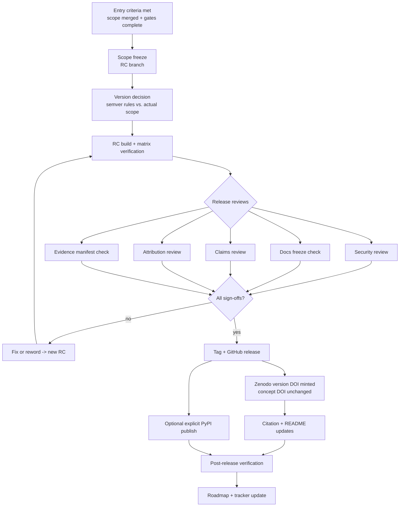

# Design: Versioned Follow-Up Release

Status: Proposed

This document designs the release process for a future public CAV-Bench
version that may include the production-quality LangGraph adapter, the
generic protocol integration, the commerce-v1 profile, independent-run
tooling, and validated reproducibility artifacts — roadmap workstream W8
and Gate 4 (`docs/strategy/90-day-engineering-program.md`). It extends,
and where it conflicts defers to, the existing
`docs/release-process.md` mechanics.

**No version number is selected or changed in this PR.** Whether the
release is 1.1.0, 1.x, or 2.0.0 is decided by the semantic-version rules
below against the actually-merged scope, at release time.

## Executive summary

The follow-up release is gated, not scheduled: it ships when its entry
criteria are met, freezes scope explicitly, decides its version number by
documented semver rules, and passes a claims-and-attribution review that
blocks publication of anything externally unsubstantiated — the release
gate's defining property. The design covers entry criteria, scope freeze,
versioning and compatibility policy, schema and deprecation policy, the
supported Python and optional-dependency matrices, a release-candidate
process, the reproducibility package and evidence manifest, security,
documentation, claims, and attribution reviews, tagging, package
publication, Zenodo archiving with concept-vs-version DOI handling,
post-release verification, rollback/yank/hotfix paths, and the roadmap
update that closes the loop.

## Problem statement

v1.0.0 shipped a self-contained benchmark. The follow-up release will be
the first to carry integrations (framework adapter, protocol layer), an
applied profile, and — critically — claims about external validation
activity. A release that overstates external evidence would violate the
project's claim discipline at its most visible surface. The release
process therefore needs a structural gate: **publication is blocked while
any external-evidence or attribution claim in the release artifacts
cannot be substantiated from recorded evidence**
(`docs/program/external-evidence-policy.md`).

## Intended users and stakeholders

- **Adopters** installing the release and relying on its compatibility
  guarantees.
- **External runners and reviewers** whose contributions must be
  attributed accurately and only with permission.
- **Maintainers** executing the process.
- **Citing researchers** relying on DOI correctness
  (`docs/citation.md`).

## Goals

- A deterministic, checklist-driven path from "scope candidates merged"
  to "verified public release."
- Version and compatibility decisions derived from rules, not mood.
- A claims/attribution gate with teeth.
- A reproducibility package that lets outsiders verify the release's
  central technical claims.

## Non-goals

- No version number selection now; no release date commitment.
- No claim any scope item is release-ready today (none are merged).
- No PyPI auto-publication pipeline (publication stays explicit, per
  `docs/release-process.md`); no hosted service, leaderboard, or
  certification program.

## Preconditions and dependencies

Scope candidates, each behind its own milestone and gate
(`docs/program/implementation-manifest.md`): LangGraph adapter (PR #6/#8
chain hardened to production quality), `M-GPI-1`, `M-COM-V1`, `M-IVT-1`,
plus whatever validated evidence exists from the applied workstreams. The
release milestone `M-REL-NEXT` stays `BLOCKED` until entry criteria hold.

## Functional requirements

- **REL-FR-001 (entry criteria)** — A release may enter the RC process
  only when: every scope item is merged, gate-complete, and covered by the
  full quality gate; the golden expectations (core + any new pack goldens)
  pass; no open issue is labeled release-blocking; and the draft release
  notes exist with a completed claims inventory (below).
- **REL-FR-002 (scope freeze)** — RC branch creation freezes scope: after
  freeze, only release-blocking fixes enter (via the branch rules in
  `docs/program/pr-and-branch-strategy.md`); any scope addition restarts
  the RC clock.
- **REL-FR-003 (semantic versioning)** — Version is decided by rule:
  **major** if any public API in `cavbench.api`, the CLI contract, or a
  schema contract breaks compatibility; **minor** for additive
  capabilities (new adapters, packs, extras, CLI subcommands) with all
  existing behavior intact and `core-v1` goldens unchanged; **patch**
  reserved for fix-only releases. New optional extras and new packs are
  additive → the anticipated shape is a **minor** release, but the rule,
  applied at freeze, decides.
- **REL-FR-004 (compatibility guarantees)** — The release notes must state
  explicitly: which public surfaces are stable (`cavbench.api`, CLI
  commands and their manifest/output layouts, schema versions), which are
  provisional (new integration surfaces on first release), and that
  `core-v1` scenario semantics and canonical ablation results are
  unchanged (or, if ever not, a major-version, decision-logged event).
- **REL-FR-005 (schema-version policy)** — `scenario-v1` / `trace-v1` /
  `evaluation-v1` contracts change only additively within a schema major;
  any non-additive change bumps the schema version, ships alongside the
  old version's continued readability (`replay` must still read prior-
  version artifacts), and requires a `DECISION_LOG.md` entry and migration
  notes.
- **REL-FR-006 (deprecation policy)** — Deprecations are announced in
  release notes ≥ one minor release before removal, emit runtime warnings
  where feasible, and are listed in a dedicated release-notes section.
  Removal requires a major release.
- **REL-FR-007 (migration guidance)** — Any behavior an adopter must
  change for gets a migration note in the release notes; schema bumps get
  a migration section in docs.
- **REL-FR-008 (support matrices)** — The release records its supported
  Python matrix (currently 3.11–3.13 per D-008; adding 3.14 is a
  release-time decision recorded here) and an optional-dependency matrix:
  for each extra (`reporting`, proposed `langgraph`, `rest`, `mcp`), the
  supported dependency version range and the CI job that exercises it.
  Core must remain installable and fully functional with no extras
  (D-009).
- **REL-FR-009 (release-candidate process)** — At least one tagged RC
  (`vX.Y.Z-rc.1`) built and smoke-tested from a clean checkout per
  `docs/release-process.md`, plus the extras matrix, on every supported
  Python version; RC soak until all release reviews (below) pass; each RC
  defect fix produces a new RC.
- **REL-FR-010 (reproducibility package)** — The release ships a
  reproducibility package: exact reproduction commands, expected outputs
  (canonical ablation for core; golden expectations for any new pack),
  pack digests, and — where independent-run bundles exist at a
  publishable disclosure level — references to those bundles. It must be
  verifiable offline from the released artifacts.
- **REL-FR-011 (evidence manifest)** — The release includes an evidence
  manifest enumerating every externally-facing claim in the release notes
  and README changes, each mapped to its evidence class and reference per
  `docs/program/external-evidence-policy.md`. A claim with no reference
  is removed or reworded before tagging — this is the release gate's
  blocking check.
- **REL-FR-012 (security review)** — Pre-tag review: dependency audit of
  all extras, secrets scan of the tree and built artifacts,
  `SECURITY.md` accuracy check, and review of any new network-facing code
  (reference server) for safe defaults (loopback binding, synthetic data).
- **REL-FR-013 (documentation freeze)** — Docs are frozen with the RC:
  every shipped capability documented, every link valid, statuses of
  design documents updated to reflect reality (a design still unbuilt
  stays `Proposed` and is not listed as shipped).
- **REL-FR-014 (claims review)** — A named reviewer walks the prohibited-
  claims list (no endorsement/adoption/certification/production-readiness
  language, no "officially supported" for any framework or protocol) over
  release notes, README, and changed docs; recorded sign-off required.
- **REL-FR-015 (attribution review)** — Every named external person,
  organization, run, or quotation is checked against recorded permission
  (validation tracker + disclosure records); missing permission →
  anonymize or remove; recorded sign-off required.
- **REL-FR-016 (release notes)** — Follow the `docs/release-process.md`
  template: highlights, breaking changes, canonical ablation table (plus
  new-pack tables if applicable), reproduction pointer, full-changelog
  link, plus the compatibility, deprecation, and matrices sections above.
- **REL-FR-017 (tagging and publication)** — Annotated tag `vX.Y.Z` after
  all sign-offs; `CHANGELOG.md` `[Unreleased]` content moved to the dated
  section; `pyproject.toml` version matches the tag; GitHub release
  created from the tag; PyPI publication only on explicit maintainer
  action.
- **REL-FR-018 (Zenodo and DOIs)** — The GitHub release triggers the
  existing Zenodo integration: a **new version DOI** is minted for this
  release while the **concept DOI (10.5281/zenodo.21364385) is unchanged**
  and continues resolving to the latest version. Post-mint:
  `CITATION.cff` (`version`, `date-released`, version-DOI identifier) and
  README citation section updated per `docs/release-process.md`;
  reproducibility claims must cite the **version DOI**, never the concept
  DOI (`docs/citation.md` rule).
- **REL-FR-019 (post-release verification)** — Within a defined window:
  fresh-environment install from the published artifact (and PyPI, if
  published); `cavbench doctor`; reproduction of the canonical table;
  link and DOI resolution checks; results recorded.
- **REL-FR-020 (rollback and yank)** — A defective release is never
  deleted: the git tag stays (history is immutable); PyPI artifacts may be
  **yanked** (installable by pin, not by default) with the reason recorded
  in the changelog and GitHub release notes; Zenodo versions are immutable
  — a defect is superseded by the next release, with the Zenodo record's
  metadata annotated where possible.
- **REL-FR-021 (hotfix process)** — Critical post-release defects branch
  from the release tag (`release/` branch rules), fix only the defect,
  and ship as a patch release through an abbreviated but complete gate
  (quality gate + security scan + claims delta review).
- **REL-FR-022 (roadmap update)** — Release closes with a roadmap/tracker
  update: outcomes achieved vs. open, gate states advanced, next-cycle
  scope reset. A release does not silently mark program outcomes done.

## Non-functional requirements

The full process must be executable by a single maintainer plus named
reviewers, from checklists, without tribal knowledge; every sign-off is a
recorded artifact; total RC-to-publish time is bounded by review
availability, not by tooling.

## Architecture

## Component responsibilities

- **Release checklist** (extends `ACCEPTANCE_CHECKLIST.md` +
  `docs/release-process.md`): the single ordered source of steps.
- **Evidence manifest**: claims inventory + evidence references; owned by
  the claims reviewer.
- **RC branch**: freeze boundary; owned by the release driver.
- **Review sign-offs**: four named records (security, docs, claims,
  attribution).
- **Verification record**: post-release check results.

## System boundaries

The release process touches version metadata, changelog, docs, tags, and
publication channels. It never modifies benchmark semantics: any semantic
change discovered during RC is a scope change that exits the RC, goes
through normal development (decision log and all), and re-enters later.

## Trust boundaries

The release gate treats **the project's own claims as untrusted until
evidenced**: the evidence manifest is the mechanism, the external-evidence
policy is the rulebook, and the attribution review enforces that external
parties' names appear only with recorded permission. Automation (including
any agent executing the release checklist) may prepare artifacts but may
not self-certify the four reviews — those are human sign-offs by
definition (`docs/program/gate-state.md`).

## Data and evidence flow

Merged scope → RC artifacts → review records → tag → GitHub release →
Zenodo DOI → citation updates → verification record → roadmap update.
Independent-run bundles and case-study records flow **into** the release
only by reference at their recorded disclosure level.

## State and lifecycle model

`M-REL-NEXT` gate states: `BLOCKED (entry criteria unmet) → PROPOSED
scope → FROZEN (RC) → UNDER_REVIEW → APPROVED (all sign-offs) →
PUBLISHED → VERIFIED → CLOSED (roadmap updated)`, with loops from
`UNDER_REVIEW` back to `FROZEN` on RC defects, and terminal
`SUPERSEDED`/`YANKED` states post-publication.

## Failure modes

- Entry criteria never fully met in the program window → ship a smaller
  honest release (rule REL-FR-003 applied to lesser scope) or no release;
  a partial release with accurate claims beats a complete one with
  padded claims.
- Unsubstantiatable claim found late → reword/remove, new RC; the gate
  exists precisely for this and it is a normal outcome, not an incident.
- Zenodo mints against a defective release → immutable; supersede via
  next release; annotate metadata.
- PyPI publish of a broken wheel → yank + patch release (REL-FR-020/021).
- Golden deviation appears during RC → stop; that is the `CLAUDE.md`
  canonical-results stop condition, not an RC fix.

## Recovery behavior

Every pre-tag failure recovers by iterating RCs. Every post-tag failure
recovers **forward** (patch or superseding release) — tags and DOIs are
never rewritten. The changelog records defects and yanks so the public
history is self-correcting.

## Security considerations

Covered by REL-FR-012; additionally, release artifacts are built from a
clean checkout to prevent local-tree contamination, and the built wheel's
contents are diffed against the expected file manifest before upload.

## Privacy and disclosure considerations

The attribution review (REL-FR-015) is the enforcement point: no external
identity, quotation, or run detail beyond its recorded disclosure level;
restricted tracker records never enter release artifacts.

## Determinism and reproducibility requirements

The reproducibility package must let a third party, offline, from
released artifacts: rebuild, re-run the canonical ablation, and match the
published tables exactly. Any new pack ships with its own golden table
under the same standard. The evidence manifest itself is a plain
reviewable document.

## Observability and audit evidence

The complete release is auditable from public artifacts: tag, release
notes, changelog, evidence manifest, verification record, DOI chain. The
four sign-offs are recorded in the release PR or an equivalent tracked
document.

## Test strategy

Process-level: a **release rehearsal** on a throwaway tag namespace
(no publication) exercising checklist, matrix builds, and evidence-
manifest tooling before the first real RC. Technical: existing quality
gate + wheel smoke test + extras matrix + goldens; a changelog/version
consistency check; link validation across frozen docs.

## Acceptance criteria

1. Release rehearsal completes from checklists alone.
2. First real RC: all four reviews produce recorded sign-offs; evidence
   manifest has zero unreferenced claims.
3. Published release passes post-release verification, including DOI
   resolution and citation-file correctness.
4. Roadmap/tracker updated; no program outcome marked complete without
   its evidence reference.

## Delivery phases

1. Design approval (this document).
2. Release checklist + evidence-manifest template authored (part of
   `M-REL-NEXT` preparation, buildable early).
3. Rehearsal.
4. Entry-criteria wait (gated on other milestones — expected to be the
   long pole).
5. RC → reviews → publish → verify → close.

## Rollback or abandonment criteria

Abandoning a release attempt pre-tag costs nothing but the RC branch.
Post-tag rollback is forward-only (REL-FR-020). Abandon this process
design only if Gate-4 review finds the review burden disproportionate —
in which case reviews may be consolidated but the evidence-manifest
blocking property must survive in any successor design.

## Open questions

1. Python 3.14 support in the matrix at release time?
2. Should the reproducibility package be a repository directory, a
   release asset, or both? Proposed: both (directory canonical, asset
   convenience).
3. Are RC tags published to PyPI as pre-releases, or GitHub-only?
   Proposed: GitHub-only.
4. Minimum RC soak time, given reviews are the real gate? Proposed: no
   fixed soak; sign-offs gate.
5. Who are the four named reviewers in a small-team reality — can claims
   and attribution reviews share one reviewer distinct from the release
   driver? Proposed: yes, but never the release driver.

## Explicit claims and non-claims

Claims when executed: "release vX.Y.Z contains the enumerated scope; its
externally-facing claims are each evidence-referenced; reproduction
instructions and expected outputs are published and verified."

Non-claims: no release date, version number, or scope is committed by
this design; no scope item is currently release-ready; inclusion of an
integration in a release is not endorsement by, or official support of,
any framework or protocol; and the release gate's existence is not a
certification scheme — it constrains this project's claims only.
