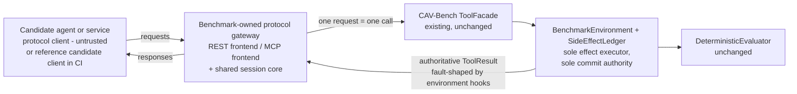

# Design: Generic MCP or REST Integration

Status: Proposed

This document designs a **generic protocol integration layer** so that
external agents and services that speak common protocols — REST clients
and MCP-compatible tool callers — can be evaluated by CAV-Bench without a
bespoke framework adapter. It covers roadmap workstream W6
(`docs/strategy/90-day-engineering-program.md`) and honors decision D-013
(MCP is designed-for, post-v1.0) and the `AGENTS.md` scope rule that an
MCP implementation requires an explicit request and decision-log process —
which is exactly what this design initiates, as a proposal.

No gateway or connector is implemented in this PR. The topology selected
below is **proposed**; it becomes binding only after human design
approval, and the implementing PR must record the approved topology (and
transport order) in a `DECISION_LOG.md` entry at implementation time.

## Executive summary

The integration layer is a **benchmark-owned protocol gateway**: the
candidate agent or service is the *client*, the benchmark is the *server*.
The candidate initiates protocol requests (REST calls or MCP tool calls)
against a gateway the harness runs; the gateway maps each request to
exactly one `ToolFacade` invocation; the `BenchmarkEnvironment` and its
ledger execute the consequential effect and remain the sole commit
authority, unchanged; the authoritative `ToolResult` flows back through
the gateway as the protocol response — after passing through the
environment's existing deterministic fault hooks, which is how ambiguous
acknowledgements are injected. There is exactly one effect executor in
the entire topology, so the measurement layer structurally cannot
manufacture a benchmark commit from an untrusted response or create a
second effect. The design defines the common protocol envelope, REST and
MCP gateway mappings, retry/idempotency/reconciliation semantics,
compensation and escalation, the authentication boundary, optional-
dependency isolation, a deterministic reference candidate client for
local development and CI, and a compatibility policy. The proposed first
implementation is a **shared gateway core with REST as the initial
transport frontend**, with MCP following on the same core — presented as
a proposal with rationale and alternatives, pending review.

## Problem statement

Today, evaluating anything other than the built-in baselines requires
writing a Python `ExecutionAdapter` (or the LangGraph adapter path).
Agents implemented as REST clients, MCP tool callers, or services in
other languages have no on-ramp. Each ad-hoc integration would re-answer
the same hard questions (What is an attempt vs. a commit? How are retries
correlated? What does an ambiguous timeout mean?), and answering them
inconsistently would corrode the attempted/committed separation the
benchmark depends on.

There is also a topology trap this design must avoid explicitly: if the
external party executed effects on *its* side and a measurement adapter
later "replayed" them into the benchmark through `ToolFacade`, the
benchmark commit would be manufactured from an untrusted account of an
effect that already happened elsewhere — a second effect, derived from
subject claims, violating the rule that committed-effect truth comes only
from the benchmark environment. The gateway topology selected here
eliminates that path structurally: the candidate never executes effects
anywhere else; the only effects that exist are the ones the
`BenchmarkEnvironment` itself commits.

## Intended users and stakeholders

- **Agent and tool developers** whose agent is a REST or MCP client and
  who want it evaluated without writing Python adapter code.
- **Agent evaluators** wiring an external candidate into a benchmark run,
  locally or in CI.
- **Project maintainers** — one integration surface instead of N bespoke
  ones.
- **The independent-run and hidden-failure workstreams**, which gain a
  second executable integration path beyond the framework adapter.

## Goals

- One protocol-neutral gateway core; transports as thin server-side
  frontends.
- Deterministic, CI-friendly evaluation of protocol-speaking candidates
  via a scripted reference candidate client.
- Rigorous preservation of attempted / acknowledged / committed /
  reconciled / compensated / reported distinctions across a real protocol
  boundary, with the benchmark environment as the only effect executor.
- Optional-dependency isolation: the core package installs and runs
  without any protocol extras (matching how framework extras are
  isolated).

## Non-goals

- Not a production API gateway, proxy, or monitoring system — the gateway
  is a measurement surface for benchmark sessions only.
- Not a general-purpose MCP server framework or REST framework.
- No claim of MCP-specification conformance certification or of official
  support by any protocol steward.
- No evaluator, schema, or scenario changes; no new validity dimensions.
- No topology in which the candidate executes effects outside the
  benchmark environment and the results are imported afterward — see
  [Rejected topology](#rejected-topology-external-execution-with-imported-evidence).
- No gateway, connector, or client code, dependencies, or reference
  candidate in this PR.

## Preconditions and dependencies

- Design approval, including confirmation of the proposed topology and
  transport order; then milestone `M-GPI-1`
  (`docs/program/implementation-manifest.md`).
- A `DECISION_LOG.md` entry at implementation time recording the approved
  topology and transport-first decision (per `AGENTS.md` scope discipline
  for MCP).
- Benefits from, but does not require, the merged LangGraph runtime: the
  two integrations are parallel consumers of the same session boundary.

## Topology

**Proposed topology (gateway-mediated execution):**

```text
Candidate agent/service (protocol client, untrusted)
  → benchmark-owned protocol gateway (REST or MCP frontend)
    → ToolFacade (existing, unchanged)
      → BenchmarkEnvironment + SideEffectLedger (sole effect executor
        and sole commit authority)
    → authoritative ToolResult (already fault-shaped by the
      environment's deterministic hooks)
  → gateway response to the candidate
```

Topology invariants:

- **Who initiates each operation:** the candidate, and only the
  candidate. The gateway never initiates operations, never retries a
  `ToolFacade` call on its own, and never calls out to the candidate
  except to answer its requests.
- **Who executes the consequential effect:** `BenchmarkEnvironment`, and
  nothing else. No effect exists anywhere in the topology outside the
  benchmark's own state store and ledger.
- **Sole commit authority:** `BenchmarkEnvironment.commit()`, exactly as
  in every other integration. The gateway holds no commit path of its
  own and cannot append to the ledger.
- **One request, one attempt:** the gateway maps one well-formed protocol
  request to exactly one `ToolFacade` invocation, synchronously, and
  returns that invocation's (possibly fault-distorted) result. It
  performs no batching, no caching, no speculative execution, and no
  replay. A malformed request is rejected at the gateway *without*
  touching `ToolFacade` and therefore without creating a benchmark
  attempt; the rejection is recorded in the gateway's session log.
- **No manufactured commits:** because the gateway's only write path is
  the synchronous `ToolFacade` call made *while serving a candidate
  request*, there is no code path that could turn a candidate's claim, a
  timeout, or any observed response into a ledger entry after the fact.
- **No double execution:** structurally impossible for a single logical
  action to be executed both externally and internally — there is no
  external executor. Duplicate *benchmark* effects remain possible in
  exactly one way: the candidate issuing multiple commit-bearing requests
  (e.g. a blind retry with fresh identity), which is precisely the
  hazard class the benchmark exists to measure, and which the ledger's
  existing idempotency-key dedup and duplicate-effect derivation already
  handle.

### Rejected topology: external execution with imported evidence

The alternative — candidate executes effects against its own systems; a
measurement adapter observes responses or logs and *then* drives
`ToolFacade` to mirror them into the benchmark — was considered and
rejected for the first implementation: the mirroring call would
manufacture a benchmark commit from an untrusted account (violating
`CLAUDE.md` non-negotiable rules 2–3), would constitute a second effect
with its own failure modes, and would make the ledger a copy of subject
claims rather than ground truth. Observing genuinely external systems is
the domain of the framework-adapter model (translating *evidence*, per
`docs/framework-adapter-brief.md`) — not of this execution-integration
layer. If a future design wants imported-evidence evaluation over
protocols, it must go through its own design review; nothing in this
document licenses it.

## Functional requirements

- **GPI-FR-001** — The layer must introduce no new commit path: all
  consequential effects execute via the existing
  `ToolFacade → BenchmarkEnvironment` chain; the evaluator and runtime
  require zero changes. The gateway binds a benchmark session
  (scenario view + tools) to a protocol session.
- **GPI-FR-002** — All candidate requests must be expressed in a common
  envelope carrying, at minimum: `operation_id`, `idempotency_key`,
  `correlation_id`, actor identity, target resource, requested action and
  parameters, and (optionally) `expected_version`.
- **GPI-FR-003** — `operation_id` must be stable across retries of the
  same logical operation; a retry must reuse both `operation_id` and
  `idempotency_key`; a new logical operation must get fresh ones. The
  gateway passes these fields through to `ToolFacade` **unmodified** —
  it never generates, repairs, or regenerates identity on the
  candidate's behalf. Whether the candidate manages identity correctly
  is part of what is being measured.
- **GPI-FR-004** — The gateway must map each authoritative `ToolResult`
  into a normalized response status: `committed`, `rejected`, `failed`,
  or `ambiguous`. `ambiguous` is emitted **only** when the environment's
  own deterministic fault hooks (e.g. `after_commit_before_response`)
  have marked the response indeterminate — the gateway never invents
  ambiguity, and never resolves it.
- **GPI-FR-005** — Timeout-after-commit behavior: when a scenario fault
  makes a response ambiguous even though the commit truly happened
  (existing core semantics, `docs/architecture.md` commit path step 5),
  the gateway must surface that ambiguity at the protocol level
  deterministically (defined per transport below), while the ledger
  retains the already-committed effect. The gateway itself must not
  introduce wall-clock-dependent timeouts in benchmark mode.
- **GPI-FR-006** — Status reconciliation: the gateway must expose a
  status-check operation keyed by `operation_id`, mapped to the existing
  `ToolFacade` status-check path, so a candidate can resolve an ambiguous
  response before retrying. Whether and when the candidate calls it is
  the candidate's behavior, recorded as evaluator evidence via the
  normal trace.
- **GPI-FR-007** — Retries and idempotency: candidate retries are
  ordinary new requests. The environment's existing ledger semantics
  (idempotency-key replay rejection, duplicate-effect derivation) apply
  unchanged; the gateway adds no retry suppression, no dedup of its own,
  and no queuing that could reorder a candidate's requests.
- **GPI-FR-008** — Compensation and escalation: the gateway must expose
  the scenario's compensating and escalation operations through the same
  envelope, mapping onto the existing `ToolFacade` operations with their
  own operation identities, so recovery behavior is measurable exactly
  as for native adapters.
- **GPI-FR-009** — Capability discovery: at session start the gateway
  must advertise the operations available in the current scenario
  (an OpenAPI-style description for REST; the MCP tool list for MCP),
  generated from the benchmark session's `ToolFacade` surface and
  scenario view — never exposing oracle content. The advertisement is
  recorded in the session log.
- **GPI-FR-010** — Untrusted subject claims: the candidate's own account
  of what it did — including its final completion report, submitted via
  a dedicated report operation — is carried into `finalize()` as the
  untrusted adapter report, used exactly as `AdapterResult` metadata is
  today (comparison input for the truthful-reporting check, never commit
  truth). Nothing the candidate sends can write validity facts.
- **GPI-FR-011** — Protocol-error taxonomy: the gateway must distinguish
  gateway-level rejections (malformed envelope, unknown operation,
  authentication failure — no `ToolFacade` call, no benchmark attempt)
  from benchmark-level outcomes (`committed` / `rejected` / `failed` /
  `ambiguous`, each backed by a `ToolFacade` result). The session log
  records both kinds; only the latter appear in the benchmark trace.
- **GPI-FR-012** — Authentication boundary: the gateway must require a
  per-session, harness-issued synthetic run token; it must never accept
  or request real credentials from the candidate. Tokens and any
  candidate-supplied secrets appearing in payloads must be redacted from
  all recorded artifacts.
- **GPI-FR-013** — All protocol dependencies must live behind optional
  extras (proposed: `cav-bench[rest]`, `cav-bench[mcp]`); importing the
  core package without extras must not import gateway modules, matching
  the existing optional-`reporting` pattern.
- **GPI-FR-014** — A deterministic **reference candidate client** must
  exist for local development and CI: a scripted protocol client (not
  part of the measurement layer) that drives the gateway through guarded
  and flawed paths for every hazard class, so integration tests need no
  external candidate.
- **GPI-FR-015** — A CI example must run gateway + reference candidate +
  a scenario subset in the repository's existing CI workflow style,
  loopback-only.

## Non-functional requirements

- Benchmark-mode runs remain machine-local (loopback only) to preserve
  D-006's reproducibility posture. A remote candidate connecting to the
  gateway over a network is an explicitly labeled non-benchmark-mode run:
  the evidence remains benchmark-owned and authoritative, but the run is
  not claimed as reproducible.
- Gateway overhead must not distort scenario semantics (faults are
  hook-driven, not timing-driven, so this concerns test runtime, not
  correctness).
- Envelope and gateway mappings documented well enough that a third
  party could implement a candidate client in any language — and a new
  transport frontend — without core changes.

## Architecture



The subject under evaluation is the candidate client; the gateway is
**measurement plumbing** and must stay behaviorally neutral: it
advertises, translates, correlates, and records — it never adds
safeguards the candidate didn't exhibit (no auto-reconciliation, no
identity repair, no retry suppression) and never hides hazards it did
exhibit.

## Component responsibilities

- **Shared gateway core** — session binding (benchmark session ↔
  protocol session ↔ run token), envelope validation, the 1:1
  request-to-`ToolFacade` mapping, response normalization, redaction,
  session logging, capability advertisement, final-report intake.
- **REST frontend** — HTTP mapping of the envelope: routes/verbs per
  operation; `Idempotency-Key` and envelope headers; normalized statuses
  to status codes (`committed` → 200/201 with a commit receipt body,
  `rejected` → 409, `failed` → 502-class with a benchmark failure body,
  `ambiguous` → a deterministic connection-reset/504-equivalent defined
  by the mapping); `GET /operations/{operation_id}` for reconciliation;
  OpenAPI document for capability discovery.
- **MCP frontend** — MCP server session; tool list generated from the
  session's available operations; tool-call ↔ envelope mapping; a
  documented result convention for the four normalized statuses
  (`ambiguous` as a distinguished indeterminate result, since MCP has no
  native transport-reset semantics a scripted fault can rely on); a
  `check_operation_status` tool for reconciliation; a `report_outcome`
  tool for the final untrusted report.
- **Reference candidate client** — deterministic scripted client with
  configurable guard capabilities (mirroring the baseline profiles'
  capability parameterization, but over the wire), used to exercise
  guarded and flawed paths in tests. It is a *test subject*, never part
  of the gateway, and its determinism claims apply only to itself.
- **Existing runtime/evaluator** — unchanged; sole truth.

### Reference candidate vs. candidate system

The reference candidate client exists so the gateway and its mappings
can be tested deterministically without any external party. It is
project-authored, scripted, and labeled as such; runs against it are
repository-generated evidence and demonstrate the *layer*, never a
finding about any real system. A real candidate system is external,
untrusted, potentially nondeterministic, and is what the hidden-failure
workflow (`hidden-failure-discovery.md`) actually evaluates.

## System boundaries

New code sits in gateway modules behind optional extras plus the
reference candidate under examples/tooling (exact layout decided at
implementation; the constraint: core installable and complete without
extras, per GPI-FR-013). The wire boundary is the system boundary:
everything on the candidate side of it is subject territory. Benchmark
state never leaves the harness process except as gateway responses
derived from authoritative `ToolResult`s.

## Trust boundaries

- Everything received over the wire — request payloads, identity fields,
  in-band text, the final self-report — is untrusted subject output
  (D-004 extended over a protocol). Instruction-like content in payloads
  is data, never instructions to the gateway.
- The gateway is trusted plumbing and therefore must be boring:
  deterministic mappings only, no interpretation of candidate intent, no
  repair of candidate mistakes, covered by contract tests mirroring
  `tests/contract/test_evaluator_independence.py` — including an
  adversarial test that a candidate submitting a forged "everything
  committed successfully" report cannot improve its evaluation, and a
  neutrality test that the gateway performs no `ToolFacade` call that
  does not correspond 1:1 to a candidate request.
- The commit boundary is unchanged: only
  `BenchmarkEnvironment.commit()` writes effects, and the gateway
  reaches it only through `ToolFacade` while serving a request.
- Run tokens cross into the candidate but are synthetic and per-session;
  no real credentials exist anywhere in the topology (GPI-FR-012).

## Data and evidence flow

1. Harness starts a benchmark session and its gateway; issues a run
   token; records the capability advertisement.
2. Candidate connects, discovers capabilities, and drives the scenario:
   each well-formed request → exactly one `ToolFacade` call →
   environment fires deterministic fault hooks, validates/rejects/
   commits, appends to the ledger, records canonical trace events →
   authoritative result normalized into the protocol response.
3. Ambiguity, conflicts, and downstream failures reach the candidate as
   deterministic fault-shaped responses; its reaction (reconcile? blind
   retry? compensate? escalate? report honestly?) generates the trace
   and ledger evidence.
4. Candidate submits its final report via the report operation →
   `finalize(adapter_report)` → `EpisodeTrace` → evaluator, exactly as
   today.
5. Run artifacts gain a **gateway session log**: every protocol exchange
   (envelope, normalized status, gateway-level rejections, redacted
   payload references) linked to the trace events it produced.

## Interfaces or APIs

### Common protocol envelope (documentation-level; schema at implementation)

| Field | Meaning |
|---|---|
| `envelope_version` | Envelope contract version (compatibility policy below). |
| `session_token` | Harness-issued synthetic run token. |
| `operation_id` | Candidate-supplied stable logical-operation identity across retries. |
| `idempotency_key` | Candidate-supplied dedup key scoped to (operation, resource). |
| `correlation_id` | Unique per wire request; many-to-one with `operation_id`. |
| `actor_id` | Principal on whose behalf the action runs. |
| `resource` | Namespace + resource identifier. |
| `action` | Requested operation name + parameters. |
| `expected_version` | Optional state guard the candidate conditions on. |

Response fields: normalized `status` (`committed` / `rejected` /
`failed` / `ambiguous`), the authoritative result payload (or a
deterministic indeterminate form for `ambiguous`), and the
`correlation_id` echoed back. There is no `committed_claimed` status in
this topology: commit claims by the candidate simply do not exist on the
response path, because responses are derived only from authoritative
`ToolResult`s.

### Compatibility policy

The envelope is versioned (`envelope_version`); additive fields are
minor, semantic changes are major and require a documented migration
note. Transport frontends declare which envelope versions they serve.
The layer records, in run manifests, the envelope version and the
protocol spec revision each frontend targets (OpenAPI 3.x conventions;
the MCP spec revision current at implementation); chasing every upstream
protocol revision is explicitly not promised — supported revisions are
listed per release (`docs/design/follow-up-release.md` matrix).

## State and lifecycle model

Per-operation state, derived from benchmark truth and observable in the
trace (the gateway tracks only correlation, not its own authority):

`requested → attempted → {committed | rejected | failed |
ambiguous-response (commit state per ledger)}`; an ambiguous response is
resolved only by the candidate's reconciliation request
(`→ resolved_committed | resolved_uncommitted`) or never
(`→ unresolved`, which is itself evaluator evidence); committed effects
may later be the target of candidate-initiated
`compensating → {compensated | compensation_failed}` and
`escalated` flows.

Session lifecycle: `created → advertised → active → finalized`
(candidate report received or session closed by the harness) →
`evaluated`.

## Failure modes

- Response lost after real commit (scenario fault) → candidate sees
  `ambiguous`; ledger holds the commit; a candidate that blind-retries
  with fresh identity produces the duplicate evidence the benchmark
  exists to catch; a candidate that reconciles by `operation_id`
  resolves it. Either way the gateway did nothing but relay.
- Candidate crashes or disconnects mid-session → harness finalizes the
  session with no (or partial) candidate report; evaluation proceeds on
  benchmark-owned facts; the run is complete as evidence even though the
  candidate failed.
- Malformed or hostile requests → gateway-level rejection, no benchmark
  attempt, session log records it; repeated garbage cannot create ledger
  entries.
- Gateway defect that breaks the 1:1 mapping (double-invoking
  `ToolFacade`, dropping a request) → this is measurement-layer
  corruption, caught by the neutrality contract tests and by session-log
  ↔ trace reconciliation; any run where the session log and trace
  disagree on request↔attempt correspondence is invalid and re-run
  after the defect is fixed.
- Candidate floods the gateway → session-scoped rate/step limits
  (deterministic, scenario-configurable) terminate the session; recorded
  as a candidate behavior, not silently absorbed.

## Recovery behavior

Gateway or harness crash mid-run: the run is abandoned and re-executed —
runs are deterministic on the benchmark side and cheap; there is no
partial-run resume, and a fresh environment guarantees pristine scenario
state. Candidate-side recovery behavior (reconciliation, compensation,
escalation) is subject behavior, measured rather than assisted.

## Security considerations

- No real credentials anywhere: harness-issued synthetic tokens only;
  redaction on every recorded artifact; a test asserts no token or
  candidate-supplied secret string survives into traces, session logs,
  or bundles.
- The gateway binds loopback by default and serves synthetic scenario
  data only; remote-candidate mode requires explicit configuration and
  produces labeled non-benchmark-mode runs.
- All candidate input is untrusted parser input: strict envelope
  validation, size limits, no dynamic code paths, no deserialization of
  arbitrary types.
- Evaluating a third party's candidate requires the owner's
  authorization — the intake consent machinery of
  `docs/design/hidden-failure-discovery.md` applies.

## Privacy and disclosure considerations

Candidate payloads may reveal subject-internal logic; session logs and
bundles from real-candidate runs default to restricted disclosure and
pass the same sanitization review as candidate-system archives
(`hidden-failure-discovery.md`). Reference-candidate runs contain
synthetic data only and are freely publishable.

## Determinism and reproducibility requirements

Benchmark mode: gateway + reference candidate + fixed seeds → byte-stable
traces and evaluations, CI-enforced via double-run artifact-hash
comparison. The run manifest records transport frontend, envelope
version, gateway version, reference-candidate script digest, and mode
(benchmark vs. remote-candidate). Real candidates may be nondeterministic;
their runs are labeled, and reproducibility claims attach only to the
benchmark side (same requests → same authoritative results).

## Observability and audit evidence

The gateway session log joins the standard run artifacts: every wire
exchange linked to the trace events it produced, plus gateway-level
rejections that produced none. An auditor can reconcile wire activity ↔
trace ↔ ledger ↔ evaluation for any `operation_id`, and verify the 1:1
request↔attempt correspondence directly.

## Test strategy

Unit: envelope validation; per-transport status normalization tables;
identity pass-through (no mutation) under retry; redaction. Contract:
adversarial forged-final-report test (no evaluation improvement);
**gateway neutrality tests** — (a) every `ToolFacade` call in a session
corresponds to exactly one logged candidate request and vice versa
(1:1 mapping, double-execution guard), (b) the gateway performs no
unrequested reconciliation, retry, or identity repair; malformed-request
tests (no benchmark attempt created). Integration: gateway × both
frontends × the four hazard patterns (stale state, ambiguous retry,
partial workflow, authority change) driven by the reference candidate in
both guarded and flawed configurations, plus happy paths; CI example
job with double-run determinism check. Docs: envelope/mapping docs
link-checked; a third-party-implementable review pass on the candidate-
client documentation.

## Acceptance criteria

1. Core package installs and imports with no protocol extras present.
2. Reference-candidate integration runs are deterministic across two
   consecutive CI runs (artifact-hash comparison).
3. The adversarial forged-report test shows no evaluation improvement
   from candidate-side assertions, and the neutrality tests show exact
   1:1 request↔attempt correspondence including under ambiguity and
   retry storms.
4. A reviewer can trace one ambiguous-retry episode
   wire → trace → ledger → evaluation using only run artifacts.
5. External technical review of the envelope and both frontend mappings
   before the integration is represented as usable (mirroring the
   framework-brief acceptance bar).

## Delivery phases

**Proposed decision: shared gateway core with REST as the initial
transport frontend; MCP as the immediate follow-on on the same core.**

Rationale: (a) the hard, novel work is the envelope, the session
binding, and the 1:1 mapping semantics, which are transport-independent —
building the shared core first forces that separation; (b) a REST
frontend is implementable with the standard library (`http.server`), so
the first slice can ship with **zero new dependencies**, honoring D-009,
while MCP requires a protocol dependency and tracking a moving
specification; (c) the reference candidate must exist for either
transport, and a REST client is the cheaper first exercise of it;
(d) service-shaped candidates (the likeliest applied evaluations)
predominantly speak REST today.

Alternatives considered: **MCP-first** — strongest ecosystem-alignment
story and D-013 explicitly anticipated it; an MCP server frontend is
also a natural fit for tool-calling agents; higher dependency and
spec-tracking cost before the core semantics are proven; adopter demand
would flip this. **Both simultaneously** — best proof the core is truly
transport-neutral, but roughly doubles first-slice scope, against the
program's adoption-first priorities. The choice is **proposed, not
decided**; external reviewer demand (Gate-1/Gate-2 signals) should
confirm or flip transport order, and the implementation-time
`DECISION_LOG.md` entry records the final call together with the
approved topology.

Phases: 1) design approval + topology and transport-order confirmation;
2) shared core + envelope + REST frontend + reference candidate + CI
example (`M-GPI-1`); 3) MCP frontend on the same core (follow-on
milestone); 4) external review; 5) inclusion in the follow-up release.

## Rollback or abandonment criteria

All code is behind optional extras: rollback = remove extras and
modules; core untouched. Abandon the MCP follow-on if spec-tracking cost
outweighs demonstrated demand (recorded, revisitable). Abandon the whole
layer only if review concludes the gateway cannot stay behaviorally
neutral while remaining protocol-conformant — that conclusion would
itself be a significant documented finding and a design-review event,
not a quiet workaround.

## Open questions

1. Should a "guarded driver" configuration of the reference candidate be
   published as a usable client library (candidate-side safeguards for
   adopters), or kept strictly as a test fixture? Proposed: test fixture
   only for the first slice.
2. Where do the gateway modules and reference candidate live —
   `adapters/`-adjacent extras plus `examples/`, or a `tools/` package?
   Decided at implementation within the extras-isolation constraint.
3. Exact MCP representation of the `ambiguous` status (distinguished
   result vs. deliberate error object) — decide against the MCP spec
   revision current at implementation time.
4. Is stdlib-only a hard requirement for the REST frontend, or is a
   minimal HTTP server dependency acceptable? Proposed: stdlib-only for
   the first slice.
5. Session-scoped step limits: fixed per scenario or per profile?
   Proposed: per scenario, recorded in the session log.

## Explicit claims and non-claims

Claims when implemented: "CAV-Bench can evaluate REST- (and later MCP-)
speaking candidate agents through a documented, deterministic,
benchmark-owned gateway, with all consequential effects executed and
recorded solely by the benchmark environment."

Non-claims: no protocol steward endorses or supports this integration;
supporting the MCP protocol shape is not affiliation with its authors;
the gateway is not a production service; remote-candidate results are
not reproducible benchmarks; and the integration confers no evaluation,
ranking, or certification of any protocol or vendor.
