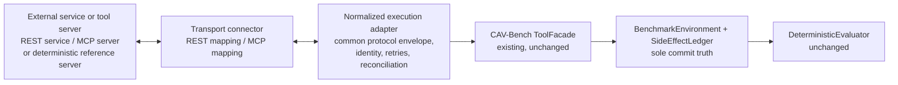

# Design: Generic MCP or REST Integration

Status: Proposed

This document designs a **generic protocol integration layer** so that
external systems that speak common protocols — REST-based services and
MCP-compatible tool servers — can be evaluated by CAV-Bench without a
bespoke framework adapter. It covers roadmap workstream W6
(`docs/strategy/90-day-engineering-program.md`) and honors decision D-013
(MCP is designed-for, post-v1.0) and the `AGENTS.md` scope rule that an
MCP implementation requires an explicit request and decision-log process —
which is exactly what this design initiates, as a proposal.

No connector is implemented in this PR.

## Executive summary

The integration layer is a shared core with pluggable transports: a
**transport connector** (REST or MCP) talks the wire protocol; a
**normalized execution adapter** maps protocol interactions into a common
protocol envelope and drives the existing `ToolFacade`; the
`BenchmarkEnvironment`, ledger, and `DeterministicEvaluator` remain the
sole source of commit truth, unchanged. The design defines the common
envelope (operation identity, idempotency, correlation, status), transport
mappings for REST and MCP, handling for retries, timeouts, ambiguous
acknowledgements, reconciliation, compensation, and escalation, an
authentication and secrets boundary, optional-dependency isolation, a
reference server for deterministic local and CI use, and a compatibility
policy. The proposed first implementation is a **shared core with REST as
the initial transport**, with MCP following on the same core — presented
as a proposal with rationale and alternatives, pending review.

## Problem statement

Today, evaluating anything other than the built-in baselines requires
writing a Python `ExecutionAdapter` (or the LangGraph adapter path).
Service-shaped agents — a REST API that performs consequential actions, or
tools exposed over MCP — have no on-ramp. Each ad-hoc integration would
re-answer the same hard questions (What is an attempt vs. a commit? How are
retries correlated? What does an ambiguous timeout mean?), and answering
them inconsistently would corrode the attempted/committed separation the
benchmark depends on. One generic layer answers them once, uniformly, at
the boundary.

## Intended users and stakeholders

- **Tool/service developers** who want their REST service or MCP server
  evaluated without learning benchmark internals.
- **Agent evaluators** wiring an external system into a benchmark run,
  locally or in CI.
- **Project maintainers** — one integration surface instead of N bespoke
  ones.
- **The independent-run and hidden-failure workstreams**, which gain a
  second executable integration path beyond the framework adapter.

## Goals

- One protocol-neutral envelope and adapter core; transports as thin
  mappings.
- Deterministic, CI-friendly evaluation of protocol-connected subjects via
  a reference server.
- Rigorous preservation of attempted / acknowledged / committed /
  reconciled / compensated / reported distinctions across a real network
  boundary.
- Optional-dependency isolation: the core package installs and runs
  without any protocol extras (matching how framework extras are isolated).

## Non-goals

- Not a general-purpose MCP client/server library or REST framework.
- Not a production gateway, proxy, or monitoring system.
- No claim of MCP-specification conformance certification or of official
  support by any protocol steward.
- No evaluator, schema, or scenario changes; no new validity dimensions.
- No connector code, dependencies, or reference server in this PR.

## Preconditions and dependencies

- Design approval, then milestone `M-GPI-1`
  (`docs/program/implementation-manifest.md`).
- A `DECISION_LOG.md` entry at implementation time recording the
  transport-first decision actually approved (per `AGENTS.md` scope
  discipline for MCP).
- Benefits from, but does not require, the merged LangGraph runtime: the
  two integrations are parallel consumers of the same `ExecutionAdapter`
  boundary.

## Functional requirements

- **GPI-FR-001** — The layer must expose exactly one new implementation of
  the existing `ExecutionAdapter` protocol (the normalized execution
  adapter); the evaluator and runtime must require zero changes.
- **GPI-FR-002** — All protocol interactions must be expressed in a common
  envelope carrying, at minimum: `operation_id`, `idempotency_key`,
  `correlation_id`, actor identity, target resource, requested action and
  parameters, and a normalized status.
- **GPI-FR-003** — `operation_id` must be stable across retries of the
  same logical operation; a retry must reuse both `operation_id` and
  `idempotency_key`; a new logical operation must get fresh ones. The
  layer must never silently regenerate identity on retry.
- **GPI-FR-004** — Every transport must map protocol outcomes into the
  normalized status vocabulary: `acknowledged` (transport-level receipt,
  no commit claim), `committed_claimed` (service asserts commit),
  `failed`, `ambiguous` (timeout / lost response / indeterminate), and
  `rejected`. A `committed_claimed` is untrusted subject output — never
  commit truth.
- **GPI-FR-005** — Ambiguous acknowledgements must trigger the
  reconciliation path: a status query keyed by `operation_id` before any
  retry; the layer must record whether reconciliation occurred, because
  that record is evaluator evidence.
- **GPI-FR-006** — Authoritative commit receipt: within a benchmark run,
  commit truth is established only by `BenchmarkEnvironment.commit()` on
  the benchmark side of the boundary; the connector correlates
  service-side claims with benchmark-side commits via `operation_id`, and
  discrepancies (claimed-but-not-committed, committed-but-unclaimed) are
  preserved as evidence, not resolved away.
- **GPI-FR-007** — Retries and timeouts must be deterministic and
  configurable: fixed retry budgets, deterministic backoff (no wall-clock
  jitter in benchmark mode), per-operation timeout values recorded in the
  trace.
- **GPI-FR-008** — Status reconciliation, compensation, and escalation
  actions must round-trip through the same envelope with their own
  operation identities, mapping onto the existing normalized event
  vocabulary of `docs/framework-adapter-brief.md`
  (`effect_reconciled`, `compensation_started/completed`,
  `escalation_created`).
- **GPI-FR-009** — Capability discovery: on session start the connector
  must enumerate the subject's available operations (OpenAPI-style
  description for REST; MCP tool listing for MCP) and record the
  enumeration in the run evidence; scenarios may require specific
  capabilities and must fail fast with a clear error when absent.
- **GPI-FR-010** — Transport-level errors (connection refused, TLS
  failure, malformed frame) and service-level errors (4xx/5xx-class,
  MCP error results) must be distinguished in the normalized mapping;
  only service-level semantics can constitute a `rejected`/`failed`
  operation outcome, while transport-level failures map to `ambiguous`
  or infrastructure failure.
- **GPI-FR-011** — Authentication: the connector must support at least
  static bearer/header credentials supplied via environment or config
  reference; credentials must never appear in traces, evidence bundles,
  logs, or error messages (redaction enforced at the envelope layer).
- **GPI-FR-012** — All protocol dependencies must live behind optional
  extras (proposed: `cav-bench[rest]`, `cav-bench[mcp]`); importing the
  core package without extras must not import connector modules, matching
  the existing optional-`reporting` pattern.
- **GPI-FR-013** — A deterministic **reference server** (one binary
  surface, both transports as thin frontends) must exist for local
  development and CI, exercising every normalized status including
  scripted ambiguity — so integration tests need no external service.
- **GPI-FR-014** — A CI example must run the reference server + connector
  + a scenario subset in the repository's existing CI workflow style,
  network-local only.

## Non-functional requirements

- Benchmark-mode runs remain machine-local (loopback only) to preserve
  D-006's reproducibility posture; evaluating a remote live service is an
  explicitly non-benchmark, non-reproducible mode and must be labeled as
  such in output manifests.
- Connector overhead must not distort scenario timing semantics (faults
  are hook-driven, not timing-driven, so this is about test runtime, not
  correctness).
- Envelope and mappings documented well enough that a third party could
  implement a new transport (e.g. gRPC) without core changes.

## Architecture

The subject under evaluation is the external service plus whatever agent
logic drives it; the connector and normalized adapter are **measurement
plumbing** and must stay behaviorally neutral: they translate, correlate,
and record — they never add safeguards the subject didn't exhibit, and
never hide hazards it did. (A configurable "guarded driver" mode for
ablation-style comparisons is listed under open questions; by default the
layer is a faithful translator.)

## Component responsibilities

- **Transport connector (REST)** — HTTP request/response mapping: verb +
  route ↔ envelope action; `Idempotency-Key` header conventions; status
  codes → normalized statuses (2xx → `committed_claimed`/`acknowledged`
  per endpoint semantics, 409 → `rejected`, timeout → `ambiguous`, 5xx →
  `failed`/`ambiguous` per idempotency semantics); OpenAPI-driven
  capability discovery.
- **Transport connector (MCP)** — MCP session lifecycle; tool listing for
  capability discovery; tool-call ↔ envelope action; MCP result/error
  objects → normalized statuses; correlation via envelope fields carried
  in tool arguments/results (MCP has no native idempotency concept — the
  envelope supplies it and the mapping documents where it rides).
- **Normalized execution adapter** — envelope construction, identity
  management (GPI-FR-003), retry/timeout policy, reconciliation
  orchestration, compensation/escalation round-trips, redaction, and the
  mapping of every interaction into `ToolFacade` calls and normalized
  events.
- **Reference server** — deterministic scripted subject: per-scenario
  behavior scripts (commit-then-lose-response, reject-on-conflict,
  fail-downstream) so every hazard class is reproducible offline.
- **Existing runtime/evaluator** — unchanged; sole truth.

## System boundaries

New code sits entirely in `adapters/`-adjacent optional modules plus a
reference-server package under examples/tooling (exact layout decided at
implementation; the constraint is: core installable and complete without
extras, per GPI-FR-012). The wire boundary is the system boundary:
everything across it is subject territory.

## Trust boundaries

- Everything received over the wire — payloads, status claims, capability
  lists, error bodies — is untrusted subject output (D-004 extended over a
  network). `committed_claimed` is exactly as untrusted as
  `AdapterResult.metadata.completion_status` is today: comparison input,
  never truth.
- The normalized adapter is trusted plumbing and therefore must be
  boring: no interpretation of subject intent, no repair of subject
  mistakes, deterministic mappings only, covered by contract tests
  mirroring `tests/contract/test_evaluator_independence.py` — including an
  adversarial test that a malicious server emitting forged
  "commit succeeded" claims cannot improve its evaluation.
- Text arriving in protocol payloads is data, not instructions — the
  connector must never alter its behavior based on instruction-like
  content in subject responses.
- Credentials cross into the connector but never into evidence
  (GPI-FR-011).

## Data and evidence flow

1. Session start: capability discovery recorded.
2. Per plan step: envelope built (identity assigned) → transport call →
   response normalized → corresponding `ToolFacade` interaction and
   normalized events recorded → on `ambiguous`, reconciliation flow before
   any retry decision.
3. Compensation/escalation steps flow identically with their own
   identities.
4. `finalize()` → trace → evaluator, exactly as today; connector adds a
   correlation log (envelope ↔ trace event references) to run artifacts
   for auditability.

## Interfaces or APIs

### Common protocol envelope (documentation-level; schema at implementation)

| Field | Meaning |
|---|---|
| `envelope_version` | Envelope contract version (compatibility policy below). |
| `operation_id` | Stable logical-operation identity across retries. |
| `idempotency_key` | Dedup key scoped to (operation, resource). |
| `correlation_id` | Unique per wire attempt; many-to-one with `operation_id`. |
| `actor_id` | Principal on whose behalf the action runs. |
| `resource` | Namespace + resource identifier. |
| `action` | Requested operation name + parameters. |
| `expected_version` | Optional state guard the caller conditions on. |
| `timeout_ms`, `attempt`, `max_attempts` | Deterministic retry/timeout config, recorded. |
| `status` | Normalized status (GPI-FR-004 vocabulary). |
| `service_result` | Untrusted subject payload, carried for evidence, redacted. |

### REST mapping sketch

`POST /orders {envelope-in-body-or-headers}` → `effect_attempted`; `200/201`
with commit semantics → `committed_claimed`; `GET /operations/{operation_id}`
→ reconciliation query; `409` → `rejected` (conflict); network timeout →
`ambiguous`. Exact conventions are reference-server-defined and documented
for services to mirror.

### MCP mapping sketch

`tools/list` → capability discovery; `tools/call` with envelope fields in
arguments → `effect_attempted`; result content → normalized status via a
documented result convention; a `check_operation_status` tool →
reconciliation. The mapping documents which envelope fields ride in
arguments vs. out-of-band metadata, and what to do when a server lacks a
status tool (ambiguity becomes terminal → evaluator sees unreconciled
ambiguity, which is precisely the evidence wanted).

### Compatibility policy

The envelope is versioned (`envelope_version`); additive fields are minor,
semantic changes are major and require a documented migration note.
Transport mappings declare which envelope versions they support. The layer
tracks published protocol specs (OpenAPI 3.x conventions; the MCP spec
revision it was built against) and records the targeted revision in run
manifests; chasing every upstream protocol revision is explicitly not
promised — supported revisions are listed per release
(`docs/design/follow-up-release.md` matrix).

## State and lifecycle model

Per-operation state machine (connector-tracked, trace-recorded):

`pending → attempted → {acknowledged | committed_claimed | rejected |
failed | ambiguous}`; `ambiguous → reconciling → {resolved_committed |
resolved_uncommitted | unresolved}`; any committed effect may later enter
`compensating → {compensated | compensation_failed → escalated}`.

Unresolved ambiguity and failed compensation both terminate in
`escalated` or in a truthful non-success report; the connector never
manufactures resolution.

## Failure modes

- Lost response after real commit → `ambiguous`; reconciliation resolves
  from the authoritative side; a subject that blind-retries produces the
  duplicate evidence the benchmark exists to catch.
- Reference-server script desync (server state diverges from scenario
  expectation) → integration-test failure, not silent evidence corruption:
  correlation log makes the divergence visible.
- Capability missing at discovery → fail-fast before any commit
  (GPI-FR-009).
- Malformed/hostile payloads → normalized as service-level errors;
  payload preserved (redacted) as evidence; never interpreted.
- Credential leakage risk in error bodies → redaction layer applies to
  all recorded payloads, including errors.
- Wall-clock nondeterminism in timeouts → benchmark mode uses scripted
  ambiguity from the reference server, not real elapsed-time races, for
  deterministic tests; live-service mode is labeled non-reproducible.

## Recovery behavior

Connector crash mid-run: the run is abandoned and re-executed — runs are
cheap and deterministic; there is no partial-run resume. The environment's
ledger semantics guarantee that a re-run starts from pristine scenario
state (each run constructs a fresh environment). Escalation and
compensation behavior belong to the subject; the connector only carries
them faithfully.

## Security considerations

- Secrets: environment/config-reference injection only; redaction on
  every recorded artifact; a test asserts no credential string survives
  into traces or bundles.
- The reference server binds loopback only and serves synthetic data.
- MCP/REST payloads are untrusted input to the connector parser: strict
  parsing, size limits, no dynamic code paths.
- Evaluating third-party live services requires the service owner's
  authorization — the intake consent machinery of
  `docs/design/hidden-failure-discovery.md` applies.

## Privacy and disclosure considerations

Live-service evaluations may capture subject-internal data in payloads;
evidence bundles from such runs default to restricted disclosure and pass
the same sanitization review as candidate-system archives. Reference-server
runs contain synthetic data only and are freely publishable.

## Determinism and reproducibility requirements

Benchmark mode: reference server + fixed seeds + scripted ambiguity →
byte-stable traces and evaluations, CI-enforced. The run manifest records
transport, envelope version, connector version, and server script digest.
Live mode: explicitly non-reproducible, labeled in the manifest, never
used for golden expectations or published metrics without that label.

## Observability and audit evidence

Run artifacts gain a connector correlation log: every wire attempt
(envelope, normalized status, redacted payload reference) linked to the
trace events it produced. An auditor can reconcile wire activity ↔ trace ↔
ledger ↔ evaluation for any operation id.

## Test strategy

Unit: status normalization tables per transport; identity stability under
retry; redaction. Contract: adversarial forged-commit-claim test; behavioral
neutrality test (connector adds no unrequested reconciliation). Integration:
reference server × both transports × the four framework-brief hazard
patterns (stale state, ambiguous retry, partial workflow, authority
change) plus happy paths; CI example job. Docs: envelope/mapping docs
link-checked; a third-party-implementable review pass on the transport
mapping docs.

## Acceptance criteria

1. Core package installs and imports with no protocol extras present.
2. Reference-server integration runs are deterministic across two
   consecutive CI runs (artifact-hash comparison).
3. The adversarial forged-claim test shows no evaluation improvement from
   subject-side assertions.
4. A reviewer can trace one ambiguous-retry episode wire→ledger→evaluation
   using only run artifacts.
5. External technical review of the envelope and both mappings before the
   integration is represented as usable (mirroring the framework-brief
   acceptance bar).

## Delivery phases

**Proposed decision: shared core with REST as the initial transport; MCP
as the immediate follow-on using the same core.**

Rationale: (a) the hard, novel work is the envelope and the
ambiguity/identity semantics, which are transport-independent — building
the shared core first forces that separation; (b) REST is implementable
with the standard library (`http.server`/`urllib`) — a REST-first slice
can ship with **zero new dependencies**, honoring D-009, while MCP
requires a protocol dependency and tracking a moving specification;
(c) the reference server needs to exist for either transport, and REST is
the cheaper frontend to validate it; (d) commerce-style subjects
(the likeliest applied evaluations) are predominantly REST-shaped today.

Alternatives considered: **MCP-first** — strongest ecosystem-alignment
story and D-013 explicitly anticipated it, but higher dependency and
spec-tracking cost before the core semantics are proven; adopters who ask
for MCP first would flip this. **Both simultaneously** — best proof the
core is truly transport-neutral, but roughly doubles first-slice scope,
against the program's adoption-first priorities. The choice is
**proposed, not decided**; external reviewer demand (Gate-1/Gate-2
signals) should confirm or flip transport order, and the implementation-
time `DECISION_LOG.md` entry records the final call.

Phases: 1) design approval + transport-order confirmation; 2) shared core
+ envelope + REST connector + reference server + CI example (`M-GPI-1`);
3) MCP connector on the same core (follow-on milestone); 4) external
review; 5) inclusion in the follow-up release.

## Rollback or abandonment criteria

All code is behind optional extras: rollback = remove extras and modules;
core untouched. Abandon MCP follow-on if the spec-tracking cost
outweighs demonstrated demand (recorded, revisitable). Abandon the whole
layer only if review concludes faithful translation across a wire
boundary can't preserve attempted/committed separation — that conclusion
would itself be a significant documented finding.

## Open questions

1. Should a "guarded driver" mode (connector-side safeguards for
   ablation-style comparison of the same subject with/without guards) be
   in scope, or does it blur the measurement-plumbing neutrality?
   Proposed: out of scope for the first slice.
2. Where does the reference server live — `examples/`, a `tools/`
   package, or shipped extra? Proposed: examples-adjacent, not shipped in
   the wheel.
3. Exact MCP envelope carriage (arguments vs. `_meta`) — decide against
   the MCP spec revision current at implementation time.
4. Is a minimal HTTP client dependency (e.g. for robustness) acceptable
   for the REST extra, or is stdlib-only a hard requirement? Proposed:
   stdlib-only for the first slice.

## Explicit claims and non-claims

Claims when implemented: "CAV-Bench can evaluate REST- (and later MCP-)
connected subjects through a documented, deterministic integration layer,
with commit truth remaining benchmark-owned."

Non-claims: no protocol steward endorses or supports this integration;
supporting the MCP protocol shape is not affiliation with its authors;
the reference server is not a production service; live-service results
are not reproducible benchmarks; and the integration confers no
evaluation, ranking, or certification of any protocol or vendor.
