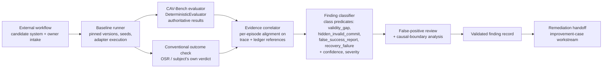

# Design: Hidden-Failure Discovery

Status: Proposed

This document designs the system and operating workflow for identifying
**hidden failures**: episodes that ordinary outcome testing reports as
successful but that CAV-Bench's evaluator identifies as commit-invalid. It
covers the roadmap outcome "at least one weakness found that ordinary
outcome testing did not expose"
(`docs/strategy/90-day-engineering-program.md`).

No real hidden failure in an external system has been discovered. Nothing
here claims one has. The `core-v1` ablation already demonstrates the
*mechanism* (a nonzero Validity Gap for unguarded profiles); this design is
about finding the same class of failure in a **real candidate system**, with
evidence that survives review.

## Executive summary

CAV-Bench already measures the gap between outcome success (OSR) and
commit-valid success (CVSR). Hidden-failure discovery operationalizes that
gap against a real subject: a candidate agent system is run through
scenarios via an adapter; a conventional outcome check and the CAV-Bench
evaluation are captured for the same episode; an evidence correlator aligns
the two on the benchmark's own trace and ledger; and a classifier —
strictly downstream of the evaluator, never overriding it — assigns each
discrepancy to explicit finding classes (`validity_gap`,
`hidden_invalid_commit`, `false_success_report`, `recovery_failure`)
with benchmark-owned predicates, and produces a validated finding record
with confidence, severity, operational consequence, and a reproduction
status. Only a `hidden_invalid_commit` finding can satisfy the roadmap's
hidden consequential-action-failure outcome. Findings pass false-positive
review and causal-boundary analysis before they may be called hidden
failures, and disclosure follows the external-evidence policy.

## Problem statement

The benchmark's central claim is that outcome-only testing misses invalid
consequential commits. The controlled ablation demonstrates sensitivity,
but by design it uses the project's own deterministic baseline profiles
(`docs/methodology.md`, "Controlled architecture ablation"). To support the
roadmap's Gate 3 ("benchmark identifies a hidden failure"), the project
needs a disciplined workflow for evaluating a real candidate system,
classifying discrepancies between conventional and CAV-Bench results, and
recording findings whose evidence is benchmark-owned, reproducible, and
reviewable — without the classification layer becoming a second,
uncontrolled evaluator.

## Intended users and stakeholders

- **Candidate-system owners** — teams whose agent, framework configuration,
  or workflow is evaluated; they receive the finding and own remediation.
- **Project maintainers** — operate the workflow, perform correlation and
  classification, run false-positive review.
- **External reviewers** — assess whether a claimed finding is real,
  reproducible, and correctly bounded.
- **The improvement-case workstream**
  (`docs/design/improvement-case-study.md`) — consumes validated findings
  as its entry precondition.

## Goals

- A repeatable intake-to-closure workflow for candidate systems.
- A finding-record schema that separates what the evaluator derived from
  what the classifier concluded.
- Confidence, severity, and false-positive controls strong enough that a
  published finding survives adversarial review.
- Clean handoff of validated findings to remediation and the
  before-and-after case process.

## Non-goals

- No new validity dimensions, failure codes, metrics, or evaluator changes.
  The classifier consumes evaluator output; it never produces benchmark
  truth.
- No framework ranking and no incident-frequency estimation
  (`docs/framework-adapter-brief.md` non-goals apply).
- No claim that any specific real system contains hidden failures.
- No public naming of a candidate system without its owner's recorded
  permission.
- No production-monitoring product; this is a benchmark-driven evaluation
  workflow.

## Preconditions and dependencies

- An executable adapter path for the candidate system: the merged LangGraph
  four-scenario runtime (PR #8 chain) for LangGraph-based candidates, the
  generic protocol integration
  (`docs/design/generic-protocol-integration.md`) for service-shaped
  candidates, or a custom `ExecutionAdapter`.
- Applicable scenarios: `core-v1`, the framework scenario pack, or (later)
  the commerce-v1 profile (`docs/design/commerce-v1-profile.md`).
- Candidate-system owner consent for the evaluation and a recorded
  disclosure agreement.
- Evidence handling per `docs/program/external-evidence-policy.md`.

## Functional requirements

- **HFD-FR-001** — Candidate intake must record: the subject system and
  exact version/configuration, the adapter used, the scenario set, the
  owner's consent and disclosure terms, and the conventional testing
  approach the subject normally relies on.
- **HFD-FR-002** — Baseline capture must pin and archive everything needed
  to re-run the evaluation: CAV-Bench version and pack digest, candidate
  system version, adapter version, seeds, and configuration — before any
  analysis begins.
- **HFD-FR-003** — For every episode, the workflow must capture the
  **conventional outcome result**: the verdict ordinary outcome testing
  would give. Its default definition is the benchmark's own OSR (final-state
  goal predicates), optionally augmented by the subject's own test verdict
  where the owner supplies one; the source used must be recorded per
  episode.
- **HFD-FR-004** — For the same episode, the workflow must capture the full
  CAV-Bench result: per-dimension status, failure codes, invalid-commit
  detail, and metrics, exactly as the `DeterministicEvaluator` produced
  them.
- **HFD-FR-005** — The evidence correlator must align, per episode, the
  conventional verdict, the evaluator result, and the authoritative
  benchmark evidence (trace events, ledger entries, state-version history)
  supporting each failed dimension — by reference into the run artifacts,
  never by copy-editing them.
- **HFD-FR-006** — A **finding candidate** exists if and only if the
  episode satisfies the `validity_gap` predicate (conventional outcome =
  pass AND the episode is not commit-valid). Every candidate must
  additionally be assigned all applicable finding classes from
  [Finding classes and predicates](#finding-classes-and-predicates), and
  exactly one `primary_class`. All classification inputs must be
  evaluator-/environment-derived; the classes are labels over evaluator
  output, never new validity semantics.
- **HFD-FR-006a** — Only a finding whose `primary_class` is
  `hidden_invalid_commit` may be counted toward, or described as, the
  roadmap's "hidden consequential-action failure" outcome. Broadening
  that outcome to other classes requires a separate, recorded design
  decision (`DECISION_LOG.md` process), not a classification judgment
  call.
- **HFD-FR-007** — Every candidate finding must receive a confidence grade
  and severity grade per the scales below, with the grading rationale
  recorded.
- **HFD-FR-008** — Every candidate finding must pass false-positive review
  before validation: scenario-applicability check, adapter-fidelity check
  (did the adapter faithfully translate the subject's behavior, or
  manufacture the failure?), oracle-correctness check, and a
  class-verification check (each recorded class's predicate re-confirmed
  against the referenced artifacts; a misclassed candidate is corrected,
  not discarded).
- **HFD-FR-009** — Causal-boundary analysis must attribute the failure to a
  layer — subject system logic, framework behavior, adapter translation, or
  scenario/oracle defect — and only subject/framework attributions may be
  reported as hidden failures of the subject. Adapter and scenario
  attributions are project bugs, filed as issues.
- **HFD-FR-010** — A validated finding must be reproduced at least once
  from the pinned baseline (same versions, same seed → same result) and the
  reproduction recorded; findings that do not reproduce stay
  `unreproduced` and may not be published as findings.
- **HFD-FR-011** — Finding review must be recorded: who reviewed, what was
  checked, outcome. External review is required before any public claim
  that a hidden failure was discovered.
- **HFD-FR-012** — Remediation handoff must deliver the finding record and
  its evidence references to the system owner, and record their response
  (accepted, disputed, deferred), feeding the improvement-case workstream.
- **HFD-FR-013** — Closure must record a terminal status: `remediated`,
  `accepted_risk`, `disputed`, `withdrawn` (false positive found late), or
  `stale` (subject changed such that the finding no longer applies).

## Non-functional requirements

- The classifier and correlator must be deterministic given the same run
  artifacts.
- Finding records must be plain JSON/Markdown, reviewable without project
  tooling.
- The workflow must be operable by one maintainer plus one reviewer;
  false-positive review must be performable by someone who did not run the
  evaluation.

## Architecture

The classifier is read-only over evaluator output: it may select, group,
and annotate, but the arrow from evaluator to correlator carries immutable
results. There is no path by which classification feeds back into scoring.

## Component responsibilities

- **External workflow / intake** — consent, scope, disclosure terms,
  conventional-testing description.
- **Baseline runner** — executes the pinned configuration; produces
  standard `runs/<run-id>/` artifacts; owns nothing analytical.
- **CAV-Bench evaluator** — unchanged; sole source of validity truth.
- **Conventional outcome check** — records the outcome-level verdict and
  its source; when it is OSR, it is simply read out of the evaluation
  result, not recomputed.
- **Evidence correlator** — builds per-episode records referencing (by
  run-id, scenario-id, event index, ledger entry) the artifacts supporting
  each discrepancy.
- **Finding classifier** — applies the class predicates of HFD-FR-006
  mechanically and selects `primary_class`; attaches confidence/severity
  with recorded rationale.
- **False-positive review & causal-boundary analysis** — human step;
  produces the attribution and the validation decision.
- **Finding record store** — append-only finding records; restricted or
  public per disclosure terms.

## System boundaries

Everything from baseline runner through evaluator is the existing CAV-Bench
runtime, unmodified. The correlator, classifier, and finding store are new
**analysis-layer** components that live outside `src/cavbench/evaluation/`
(implementation location decided at the tooling milestone; the boundary
requirement is that the core package remains importable and complete
without them). The candidate system is entirely external.

## Trust boundaries

- The candidate system, its framework, and its adapter output are
  **untrusted** — they are the evaluation subject (D-004). Their
  self-reported success is data for the truthful-reporting check, never
  commit truth.
- Committed-effect truth comes only from the benchmark environment, private
  oracle, state-version history, and side-effect ledger (`CLAUDE.md`
  non-negotiables 2–3).
- The classifier is trusted only to *summarize* evaluator output; any
  finding field that restates a validity fact must carry a reference to the
  evaluator/environment artifact it restates. A finding with an
  unreferenced validity assertion fails review.
- If any proposed mechanism would require the evaluator to consume
  adapter-supplied assertions to classify a finding, that is a `CLAUDE.md`
  stop condition — pause and escalate.

## Data and evidence flow

1. Intake record created (restricted store if the owner requires it).
2. Baseline captured and archived under the non-recursive integrity
   model of `docs/design/independent-validation-run.md` (checksum
   manifest + detached bundle root); the bundle root is recorded in the
   intake/finding records at capture time.
3. Runs executed; artifacts archived unmodified.
4. Correlator emits per-episode correlation records.
5. Classifier emits candidate findings.
6. Review annotates, attributes, and validates or rejects each candidate.
7. Validated findings delivered to the owner; tracker entry recorded
   (`docs/strategy/adoption-and-validation-tracking.md` fields: Finding,
   Remediation, Retest).

## Interfaces or APIs

No new runtime APIs. The new interfaces are the finding classes and the
finding record.

### Finding classes and predicates

For an episode `E`, all predicate inputs are benchmark-owned facts from
the evaluator result and canonical trace: `conventional_pass(E)` (the
recorded conventional verdict, default source OSR, per HFD-FR-003);
`commit_valid(E)` (the episode passes every applicable validity
dimension for every consequential commit — the episode-level fact CVSR
aggregates); `invalid_commits(E)` (the set of ledger-committed effects
the evaluator marked invalid: a stale-witness commit per D-015
mechanics, a duplicate side effect derived from ledger cardinality, a
committed forbidden/out-of-scope effect, or a commit made after
authority no longer held); the evaluator's failure codes; and the
declared recovery obligations.

| Class | Predicate (benchmark-owned) | What it captures |
|---|---|---|
| `validity_gap` | `conventional_pass(E) ∧ ¬commit_valid(E)` | The umbrella condition: outcome testing says pass, commit-validity evaluation says otherwise. Every finding candidate satisfies it by definition (HFD-FR-006). |
| `hidden_invalid_commit` | `conventional_pass(E) ∧ invalid_commits(E) ≠ ∅` | A consequential effect **actually committed to the ledger** was invalid, yet the outcome looked fine. This is the hidden committed-effect failure the document's problem statement describes. |
| `false_success_report` | `conventional_pass(E) ∧ OR_FALSE_SUCCESS_REPORT ∈ failure_codes(E)` | The subject reported completion better than the benchmark-derived floor (D-017), independent of whether any commit was invalid. |
| `recovery_failure` | `conventional_pass(E) ∧ outcome_recoverability failed for at least one non-reporting reason` — an unmet declared recovery obligation, an ambiguous operation never reconciled, or a required compensation/escalation absent or failed | A recovery-path failure hidden behind a passing outcome, with no invalid commit required. |

Rules: classes other than `validity_gap` may co-occur and all applicable
classes are recorded. `primary_class` is `hidden_invalid_commit` when
its predicate holds; otherwise `false_success_report` or
`recovery_failure` (whichever is graded operationally dominant, with the
choice's rationale recorded); otherwise `validity_gap` alone. Per
HFD-FR-006a, only `primary_class: hidden_invalid_commit` can satisfy
the roadmap's hidden consequential-action-failure outcome — the other
classes are real, reportable findings, but they are not that outcome.

### Finding-record schema

Proposed as `finding-record-v1` (documentation-level; machine schema is a
tooling deliverable):

| Field | Type | Meaning |
|---|---|---|
| `finding_id` | string | Stable ID, e.g. `HF-2026-001`. |
| `benchmark_version` | object | CAV-Bench version, git commit, pack ID + digest. |
| `scenario_or_profile` | string | Scenario ID(s) and pack, or applied profile. |
| `subject_system` | object | System name (or anonymized handle), version, framework, adapter + adapter version, configuration reference. |
| `conventional_outcome` | object | `verdict` (pass/fail), `source` (`osr` \| `subject_test_suite` \| `both`), reference to the recorded check. |
| `cavbench_result` | object | Per-dimension status, invalid-commit detail, metrics for the episode — copied verbatim with a reference to `evaluations.jsonl`. |
| `finding_classes` | list | All applicable classes per [Finding classes and predicates](#finding-classes-and-predicates). Must include `validity_gap`. |
| `primary_class` | enum | `hidden_invalid_commit` \| `false_success_report` \| `recovery_failure` \| `validity_gap`, selected per the class rules. |
| `failure_codes` | list | Evaluator failure codes observed (e.g. `OR_FALSE_SUCCESS_REPORT`), by reference. |
| `authoritative_evidence` | list | References into trace events, ledger entries, and state-version history supporting each failed dimension. |
| `causal_attribution` | enum | `subject_logic` \| `framework_behavior` \| `adapter_translation` \| `scenario_or_oracle_defect`. |
| `confidence` | enum | `high` \| `medium` \| `low` (scale below). |
| `severity` | enum | `critical` \| `major` \| `minor` (scale below). |
| `operational_consequence` | string | What this failure would mean in a real deployment, stated conditionally. |
| `reproduction_status` | enum | `reproduced` \| `unreproduced` \| `not_attempted`. |
| `review` | object | Reviewers, checks performed, decision, date. |
| `disclosure_level` | enum | Same levels as the validation-run design. |
| `remediation_status` | enum | `open` \| `handed_off` \| `remediated` \| `accepted_risk` \| `disputed` \| `withdrawn` \| `stale`. |
| `related` | object | Links: intake record, baseline bundle, improvement case (if any). |

### Confidence scale

- `high` — reproduced deterministically; evidence chain complete;
  attribution unambiguous after review; every recorded class's predicate
  verified directly against the referenced ledger/trace artifacts (for
  `hidden_invalid_commit`, the specific invalid ledger entries are
  individually referenced).
- `medium` — reproduced, but attribution between subject and framework is
  uncertain, or evidence is complete for only one failed dimension.
- `low` — observed once or attribution unresolved; not publishable as a
  finding; either upgrade through further work or close as `withdrawn`.

### Severity scale

Severity grades the operational consequence of the invalid commit class,
independent of confidence: `critical` (irreversible external effect —
duplicate payment capture, unauthorized commitment), `major` (recoverable
but customer- or ledger-visible), `minor` (internally reconcilable with no
external exposure). Severity language in published findings must remain
conditional — it describes what the failure class *would* mean
operationally, not an observed production incident.

## State and lifecycle model

Finding lifecycle:

`candidate → under_review → validated | rejected`;
`validated → handed_off → remediated | accepted_risk | disputed`;
any state `→ withdrawn` (false positive discovered) or `→ stale`.

Only `validated` findings with `reproduction_status: reproduced` and
completed review may be published, at their disclosure level, and each is
described by its class — a `recovery_failure` is reported as a recovery
failure, not as a hidden invalid commit. Only a validated, reproduced
finding with `primary_class: hidden_invalid_commit` may be described as
a hidden consequential-action failure (HFD-FR-006a). `rejected` and
`withdrawn` records are retained — they calibrate the false-positive
rate.

## Failure modes

- **Adapter-manufactured failure** — the adapter mistranslates subject
  behavior, creating a spurious invalid commit. Caught by the
  adapter-fidelity check (HFD-FR-008); attributed `adapter_translation`;
  becomes a project bug, never a finding.
- **Oracle or scenario defect** — the oracle is wrong for a legitimate
  behavior. Attributed `scenario_or_oracle_defect`; a project bug; if
  fixing it changes canonical results, the `CLAUDE.md` golden-results rule
  and D-018 discipline apply.
- **Non-reproducing candidate** — stays `unreproduced`; investigate for
  nondeterminism in the subject or adapter; never publish.
- **Conventional-check disagreement** — subject's own suite and OSR
  disagree; record both, prefer reporting against the stricter source, and
  note the disagreement in the finding.
- **Owner dispute** — finding stands as `disputed` with both positions
  recorded; publication requires the disclosure terms to cover disputed
  findings explicitly.

## Recovery behavior

Any workflow interruption resumes from the archived baseline — every stage
is a pure function of archived inputs plus recorded human decisions. If the
baseline archive is lost or fails integrity checks, the evaluation restarts
from intake; findings from a broken baseline are `withdrawn`.

## Security considerations

- Candidate-system configurations may contain secrets; intake must require
  sanitized configurations, and archives are scanned before storage.
- Finding records describe failure modes of real systems: treat unpublished
  findings as restricted records; publication follows responsible-disclosure
  timing agreed at intake (`SECURITY.md` posture applies in spirit).
- The analysis layer must not execute candidate-system code outside the
  sandboxed adapter run.

## Privacy and disclosure considerations

Subject identity is restricted by default. The disclosure levels and
permission recording from `docs/design/independent-validation-run.md` apply
per finding; a credibly anonymized finding
(`public_anonymous`) must not be de-anonymizable from its configuration
details. The validation tracker's public/restricted split governs storage.

## Determinism and reproducibility requirements

Given the archived baseline (versions, digests, seeds, configuration), the
runner, evaluator, correlator, and classifier must reproduce the identical
finding candidates. Human review steps are recorded but not required to be
deterministic. Confidence `high` requires demonstrated reproduction, not
assumed determinism.

## Observability and audit evidence

Every finding is auditable end-to-end: intake record → baseline bundle
(integrity-manifested) → run artifacts → correlation records → candidate
finding → review record → validated finding → handoff record. Each arrow is
a recorded reference; an auditor can start from a published finding and
walk back to raw trace events and ledger entries.

## Test strategy

Tooling-milestone tests (separate implementation PR): unit tests for every
class predicate (`validity_gap`, `hidden_invalid_commit`,
`false_success_report`, `recovery_failure`) and for `primary_class`
selection over synthetic evaluation results, including co-occurring
classes and all four causal attributions; a contract test
that the classifier cannot mutate evaluation results (mirroring
`tests/contract/test_evaluator_independence.py` in spirit); an integration
test running a baseline profile known to produce a Validity Gap (e.g.
`direct` on `state_mutation` scenarios) through the full pipeline and
asserting a correctly-referenced candidate finding emerges; a
false-positive fixture where the conventional check fails too, asserting no
candidate is produced.

## Acceptance criteria

1. A synthetic end-to-end demonstration: a deliberately unguarded
   configuration produces candidate findings whose every validity
   assertion carries a working evidence reference, with correct class
   assignment — at least one `hidden_invalid_commit` (e.g. `direct` on a
   `state_mutation` scenario) and at least one candidate of a different
   primary class (e.g. a `recovery_failure`), demonstrating the classes
   separate (this uses baseline profiles and is explicitly labeled a
   demonstration, not a discovery).
2. False-positive review rejects a seeded adapter-translation defect, and
   class-verification review corrects a deliberately misclassed fixture.
3. A finding record passes an external reviewer's audit walk without
   requiring project-team explanation.
4. The roadmap outcome is met only when a `validated`, `reproduced`
   finding with `primary_class: hidden_invalid_commit` exists for a real
   external candidate system — an externally-dependent event that
   automation cannot claim
   (`docs/program/external-evidence-policy.md`).

## Delivery phases

1. Design approval (this document).
2. Analysis tooling (`M-HFA-1` in
   `docs/program/implementation-manifest.md`): correlator, classifier,
   finding-record schema and templates, pipeline tests.
3. Synthetic demonstration on baseline profiles (labeled as such).
4. First real candidate intake (requires owner consent — external input).
5. First validated finding and remediation handoff (external evidence).

## Rollback or abandonment criteria

Abandon the analysis-tooling approach if review shows the classifier
cannot be kept meaningfully separate from the evaluator (i.e., correct
classification would require evaluator changes) — that would be a
methodology question requiring a `DECISION_LOG.md` process, not a tooling
workaround. Pause the workstream if no candidate system consents within
the program window; the tooling remains valid and waiting.

## Open questions

1. Should the analysis layer live in this repository (e.g. under a
   `tools/` or optional-extra module) or a sibling repository? The
   optional-dependency isolation rule in `CLAUDE.md` must hold either way.
2. Should `subject_test_suite` conventional verdicts be required at intake,
   or is OSR-only acceptable for the first finding?
3. What responsible-disclosure default window should intake terms propose
   for `critical`-severity findings?
4. Do disputed findings ever get published at `public_anonymous`, or only
   with explicit owner sign-off?

## Explicit claims and non-claims

Supported claim shape, once evidence exists (for a
`hidden_invalid_commit` finding): "In a controlled CAV-Bench evaluation
of <subject/anonymized subject> at <version>, an episode that passed
conventional outcome checking committed an invalid consequential action
(<dimension>, <failure code>, ledger entries <references>), evidence
archived at <reference>." Findings of other classes use claim shapes
scoped to their class (a false-success report, a hidden recovery
failure) and are never presented as hidden invalid commits.

Non-claims: no hidden failure of any class in any real external system has been
discovered as of this document; the synthetic baseline demonstration is not
a discovery; a validated finding is not an incident-frequency estimate, a
framework ranking, or a statement about production reliability; and no
candidate system's participation implies endorsement of CAV-Bench.
