# Design: Before-and-After Improvement Case

Status: Proposed

This document designs the controlled evidence process for demonstrating
that a CAV-Bench finding led to a documented architecture, control, or
test-process change, and that a retest under comparable conditions shows a
difference — the roadmap outcomes "one documented architecture, control, or
testing-process improvement" and "one public or permissioned
before-and-after case study"
(`docs/strategy/90-day-engineering-program.md`, Gate 3).

No improvement case exists. No finding, remediation, or retest has
occurred. Everything here is process design for evidence that does not yet
exist and that automation cannot create
(`docs/program/external-evidence-policy.md`).

## Executive summary

An improvement case is a chain of frozen evidence: a preserved baseline run
showing a validated hidden failure; a remediation hypothesis naming the
specific control expected to change the result; a documented system change;
a retest under conditions comparable to the baseline (same benchmark
version, pack digest, seeds, and evaluation configuration); and a
comparison report that separates what the benchmark detected, what was
implemented, what was measured, and what may be claimed causally. The
process is designed so that the baseline cannot be retro-fitted after the
fact, confounders are recorded rather than hidden, regressions are reported
alongside improvements, and publication happens only at the system owner's
recorded permission level.

## Problem statement

"We found a problem, fixed it, and the numbers improved" is easy to assert
and easy to manufacture. Without a frozen baseline, the "before" can be
chosen after the "after" is known. Without version freezing, the benchmark
itself may have changed between runs. Without confounder handling, an
unrelated system change can masquerade as the remediation's effect. And
without disciplined language, a measured metric difference quietly becomes
a causal claim. This design makes each of those failure modes structurally
difficult and makes the residual limitations explicit in the published
artifact.

## Intended users and stakeholders

- **The remediating team** — owns the system change and the decision to
  implement it.
- **Project maintainers** — operate the retest and comparison process and
  author the case study.
- **External reviewers and readers** — assess whether the case supports its
  claims.
- **Upstream workstream** — `docs/design/hidden-failure-discovery.md`
  supplies the validated finding this process starts from.

## Goals

- A baseline-preservation mechanism that makes retrospective manipulation
  detectable.
- A retest protocol whose comparability conditions are checkable, not
  asserted.
- A comparison report format that keeps four distinct things distinct:
  benchmark-detected difference, control implementation, measured
  improvement, and causal claim.
- A publication path gated on recorded external permission.

## Non-goals

- Not a general A/B-testing or statistics framework; the comparison is a
  controlled deterministic re-evaluation, not a sampled experiment.
- No claim that improvement will occur, or that a remediation will be
  adopted by any team.
- No modification of benchmark semantics to make differences more visible.
- The case study is not a product endorsement of any framework, control
  vendor, or architecture.

## Preconditions and dependencies

- A `validated`, `reproduced` finding record from the hidden-failure
  workflow (its `finding_id` is this process's foreign key).
- The finding's baseline evidence bundle, integrity-manifested at capture
  time (`docs/design/independent-validation-run.md` bundle format).
- A system owner willing to implement (or formally accept the design of) a
  remediation and permit a retest — external input that cannot be
  automated.
- Improvement-evidence tooling (`M-IET-1` in
  `docs/program/implementation-manifest.md`) makes this low-friction but is
  not strictly required for a manual first case.

## Functional requirements

- **BAI-FR-001** — The original baseline (run artifacts, evaluation
  results, finding record, environment description) must be preserved with
  an integrity manifest **at finding-validation time**, before any
  remediation work begins; its checksums must be committed to a
  timestamped, append-only location (e.g. the finding record in version
  control) so later substitution is detectable.
- **BAI-FR-002** — Benchmark and subject versions must be frozen and
  recorded: CAV-Bench version + commit + pack digest, subject system
  version + configuration digest, adapter version, seeds. The retest must
  use the identical benchmark side; any forced deviation (e.g. a benchmark
  bug fix required to run at all) must be recorded as a comparability
  limitation.
- **BAI-FR-003** — The hidden failure being remediated must be recorded by
  reference (`finding_id`), not restated, so baseline truth has exactly one
  source.
- **BAI-FR-004** — A **remediation hypothesis** must be recorded before the
  retest: which control or change is being made, which validity
  dimension(s) and failure code(s) it should affect, on which scenarios,
  and what result difference would count as supporting improvement.
- **BAI-FR-005** — The system change must be documented in a changed-system
  manifest: what changed (architecture, control, or test process), where,
  by whom, with version/diff references sufficient for a reviewer to
  confirm the change is the one hypothesized.
- **BAI-FR-006** — The retest must run under comparable conditions: same
  benchmark version and pack digest, same scenario set, same seeds, same
  adapter version (or a recorded, justified exception), same evaluation
  configuration. A comparability checklist must be completed and recorded.
- **BAI-FR-007** — The comparison must be computed per scenario and per
  dimension, not only in aggregate: which episodes changed status, in which
  direction, with references to both runs' evidence.
- **BAI-FR-008** — Confounders must be handled explicitly: the
  changed-system manifest must enumerate *all* subject-side changes between
  baseline and retest, and the comparison report must classify each as
  hypothesized-remediation or confounder. A retest against a subject with
  unenumerable changes is recorded as `comparability: degraded`.
- **BAI-FR-009** — Regressions (episodes or dimensions that got worse) must
  be reported with the same prominence as improvements.
- **BAI-FR-010** — The comparison report must state causal limitations: at
  most, "the hypothesized control was implemented and the hypothesized
  result difference was observed under comparable conditions"; it must not
  claim the control caused the difference when confounders exist or when
  the hypothesis was written after the retest.
- **BAI-FR-011** — A recorded improvement determination must be one of:
  `supported` (hypothesis pre-registered, comparable conditions, predicted
  difference observed, no material confounders), `partially_supported`,
  `not_supported`, or `inconclusive` — decided in review, not by the person
  who ran the retest alone.
- **BAI-FR-012** — External publication requires the system owner's
  recorded permission at a specific disclosure level, per the
  case-study minimum records in
  `docs/strategy/adoption-and-validation-tracking.md`.

## Non-functional requirements

- All artifacts are plain JSON/Markdown and independently reviewable.
- The full chain must be walkable by an external auditor from published
  case study back to raw baseline traces (at the permitted disclosure
  level).
- The process must not require the subject team to adopt CAV-Bench
  tooling beyond the evaluation itself.

## Architecture

```mermaid
flowchart LR
    A[Validated finding<br/>finding_id + frozen baseline bundle] --> B[Remediation hypothesis<br/>pre-registered, versioned]
    B --> C[System change<br/>changed-system manifest]
    C --> D[Controlled retest<br/>same benchmark version,<br/>pack digest, seeds]
    A --> E[Comparison engine<br/>per-scenario, per-dimension diff]
    D --> E
    E --> F[Comparison report<br/>improvements, regressions,<br/>confounders, limitations]
    F --> G[Improvement determination<br/>review decision]
    G --> H[Case-study disclosure record<br/>owner permission + level]
    H --> I[Published or permissioned<br/>case study]
```

## Component responsibilities

- **Baseline evidence bundle** — frozen at finding validation; read-only
  thereafter; checksums recorded in version control.
- **Remediation plan** — hypothesis, expected effect, comparability plan;
  committed before retest.
- **Changed-system manifest** — complete enumeration of subject-side
  changes; owner-signed.
- **Retest evidence bundle** — same format as baseline; integrity-manifested
  at capture.
- **Comparison engine** — deterministic diff over two evaluation result
  sets; a tooling deliverable (`M-IET-1`); a manual first case may compute
  it by documented hand procedure.
- **Comparison report** — human-authored around the mechanical diff;
  contains the four-way claim separation.
- **Case-study disclosure record** — permission, level, approved text
  scope.

## System boundaries

The benchmark side (runner, evaluator, packs) is used unmodified in both
runs. The comparison engine consumes two sets of standard run artifacts and
lives in the analysis layer, outside the evaluator, with the same
placement constraints as the hidden-failure tooling. The subject system and
its change process are entirely external.

## Trust boundaries

- Baseline and retest validity truth comes only from the
  `DeterministicEvaluator` over benchmark-owned facts; the comparison
  engine diffs evaluator output and adds no validity judgments of its own.
- The changed-system manifest is **owner-supplied and untrusted for
  completeness**: the process cannot prove the enumeration of changes is
  complete. This residual trust is recorded as a causal limitation in every
  case, and is why the determination scale stops at `supported` rather
  than `proven`.
- The person authoring the comparison report must not be able to alter
  either bundle; integrity manifests and version-controlled checksums
  enforce detectability (BAI-FR-001).

### Preventing retrospective baseline manipulation

Three mutually reinforcing controls:

1. **Freeze at validation time** — the baseline bundle's integrity manifest
   is generated when the finding is validated, before remediation exists;
   its root checksum goes into the finding record, which is committed to
   the repository (or restricted store) with normal version-control
   history.
2. **Pre-registration** — the remediation hypothesis is committed before
   the retest runs; a hypothesis whose commit timestamp postdates the
   retest bundle makes the case at best `partially_supported`.
3. **Single-source truth** — the comparison engine reads both bundles by
   checksum reference; a bundle that no longer matches its recorded
   checksum fails the comparison run outright.

## Data and evidence flow

Finding record → baseline bundle (frozen) → remediation plan (committed) →
subject change (external) + changed-system manifest → retest bundle
(frozen) → mechanical comparison → comparison report → review
determination → disclosure record → publication at permitted level. Every
arrow is a recorded reference; no stage copies evidence forward except by
checksum-verified reference.

## Interfaces or APIs

No runtime API changes. Artifact structures:

### Remediation plan

`finding_id`; hypothesis statement; targeted dimension(s) and failure
code(s); targeted scenarios; the specific control/change class
(architecture / control / test-process); predicted result difference;
comparability plan (what will be held constant, known upcoming subject
changes that may confound); planned retest window.

### Changed-system manifest

`finding_id`; subject version before/after; complete change enumeration
(each: description, classification as hypothesized-remediation or
confounder, reference to diff/release notes); owner sign-off (name, date);
configuration digests before/after.

### Retest evidence bundle

Identical layout to the baseline bundle (validation-run bundle format):
raw run artifacts, validation-run manifest, integrity manifest, plus
`finding_id` linkage and the completed comparability checklist.

### Comparison report

`finding_id`; comparability checklist result (`full` / `degraded` + why);
mechanical diff (per scenario × dimension: baseline status, retest status,
direction); metric deltas (OSR, PAOSR, CVSR, VG, PAVG on the evaluated
set); regressions section (mandatory, even if empty — "none observed" is a
recorded result); confounder classification; causal-limitations section;
the four-way claim separation:

| Layer | Question it answers | Example statement shape |
|---|---|---|
| Benchmark-detected difference | What changed in evaluator output? | "CVSR on the targeted scenarios changed from X to Y under comparable conditions." |
| Control implementation | What was actually built or changed? | "A commit-time state revalidation was added at <reference>." |
| Measured improvement | Does the difference match the pre-registered hypothesis? | "The pre-registered predicted difference was observed." |
| Causal claim | What caused the difference? | At most: "consistent with the hypothesis; confounders A, B cannot be excluded." |

These four are never interchangeable: a benchmark-detected difference
without a pre-registered hypothesis is not a measured improvement, and a
measured improvement is not a causal claim.

### Case-study disclosure record

`finding_id`; owner identity; permission grantor and date; disclosure
level (same enum as the validation-run design); approved scope (metrics
only / anonymized narrative / named case); any embargo; approved
quotations.

## State and lifecycle model

`finding_validated → baseline_frozen → hypothesis_registered →
change_implemented → retest_complete → comparison_complete →
determination_recorded → disclosure_recorded → published | permissioned |
closed_unpublished`

A case may terminate early at any stage (owner withdraws, change never
ships, retest impossible) — the record of the attempt is kept, and the
partial chain is never presented as a completed case.

## Failure modes

- **Hypothesis written after retest** — detectable from commit history;
  caps determination at `partially_supported` and must be disclosed.
- **Benchmark version drift forced by circumstance** — recorded as degraded
  comparability; if evaluator semantics changed between versions, the case
  is `inconclusive` unless the baseline is re-run under the new version
  (which creates a *new* baseline, clearly labeled — never silently
  replacing the frozen one).
- **Confounded retest** — many subject changes shipped together;
  determination cannot exceed `partially_supported`; report says so.
- **Regression alongside improvement** — reported symmetrically; a case
  with material regressions may still be published, but the headline must
  reflect both.
- **Retest reproduces the failure** — determination `not_supported`; this
  is a publishable result too (with owner permission) and valuable
  benchmark evidence; it must not be discarded.
- **Owner withholds publication** — the case remains a restricted
  permissioned record; the roadmap outcome can still be met by a
  "permissioned" case, but no public claim beyond what the disclosure
  record allows.

## Recovery behavior

Every stage restarts from its recorded predecessor artifacts. A corrupted
retest bundle is re-run from the frozen configuration (a new retest, new
bundle, recorded as attempt N). A corrupted baseline is fatal to the case:
the chain restarts from a re-validated finding, and the loss is recorded.

## Security considerations

Changed-system manifests and diffs may reveal subject-internal
architecture; treat as restricted records by default. Sanitize
configuration digests' inputs. The comparison tooling processes only
benchmark artifacts and manifests — it never needs subject source access.

## Privacy and disclosure considerations

The disclosure record is the sole authority on what may be published;
default is restricted. Anonymized cases must survive the same
de-anonymization check as anonymized findings. Publication permission is
per-case and revocable prospectively (already-published material follows
the recorded grant).

## Determinism and reproducibility requirements

Both runs are deterministic given pinned versions and seeds; the comparison
is a pure function of the two bundles. A third party at sufficient
disclosure level can re-execute both sides and re-derive the comparison
exactly. Time-to-complete for the mechanical parts is bounded by two
benchmark runs plus the diff; the calendar time of the case is dominated
by the external remediation, which this process does not control.

## Observability and audit evidence

The audit chain is: finding record (with baseline checksum) → remediation
plan commit → changed-system manifest → retest bundle (with checksum) →
comparison report → determination review record → disclosure record. All
project-side artifacts are version-controlled; commit timestamps are part
of the evidence (they order hypothesis vs. retest).

## Test strategy

Tooling tests (`M-IET-1`): unit tests for the comparison diff over
synthetic evaluation pairs (improvement, regression, mixed, no-change);
integrity-check tests (mismatched checksum fails the run); a
pre-registration ordering check (tooling warns when hypothesis commit
postdates retest bundle); an end-to-end rehearsal using two baseline
profiles (e.g. `direct` as "before", `commit_guarded` as "after") —
explicitly labeled a **process rehearsal**, since profile substitution is
not a remediation of a real system.

## Acceptance criteria

1. Process rehearsal completes: two-profile comparison produces a
   comparison report with correct per-scenario diffs, symmetric
   regression reporting, and the four-way claim separation populated.
2. Tampering rehearsal: modifying one file in a frozen bundle is detected
   and fails the comparison run.
3. An external reviewer can audit the rehearsal chain unaided.
4. The roadmap outcome is met only by a real case: validated finding →
   real subject change → comparable retest → reviewed determination →
   recorded permission. Every element past the first is external input.

## Delivery phases

1. Design approval (this document).
2. Evidence tooling (`M-IET-1`): comparison engine, checklists, templates,
   tests.
3. Process rehearsal on baseline profiles (labeled).
4. Real case execution — blocked on a validated finding and a willing
   subject owner (`BLOCKED_EXTERNAL_INPUT` until then).
5. Determination, disclosure, publication at permitted level.

## Rollback or abandonment criteria

Abandon a specific case at owner withdrawal or baseline-integrity failure
(recorded, chain restarted or closed). Rework the process design if the
first real case shows the comparability checklist is unsatisfiable in
practice for real subjects — loosening comparability is a design decision
requiring review, not an in-flight judgment call. Abandoning the
workstream entirely leaves tooling usable for internal regression
comparison.

## Open questions

1. Should pre-registration require the remediation plan in the *public*
   repository, or is a timestamped restricted record acceptable when the
   subject is anonymized? Proposed: restricted acceptable, timestamp
   mechanism mandatory.
2. Is a "design-accepted but not yet implemented" remediation (owner
   formally adopts the recommended control into their backlog) sufficient
   for the roadmap's "improvement documented" outcome when no retest is
   possible in the window? Proposed: it satisfies "improvement documented"
   but not "before-and-after case."
3. Minimum retest scope: full scenario set or targeted-scenarios-plus-
   control-family? Proposed: full set, so regressions elsewhere are
   visible.
4. Who is the second reviewer for the determination when the project team
   is small — is an external reviewer mandatory for `supported`?

## Explicit claims and non-claims

Supported claim shape once a case exists: "A CAV-Bench-identified
commit-validity failure led <owner/anonymized owner> to implement
<control>; a retest under comparable conditions showed <specific metric
difference>; confounders and limitations are documented in the case
record."

Non-claims: no improvement case, finding, remediation, or retest exists as
of this document; a `supported` determination is consistency with a
pre-registered hypothesis, not proof of causation; a rehearsal on baseline
profiles demonstrates the process, never an improvement; and no measured
difference generalizes beyond the evaluated scenarios, versions, and
configuration.
