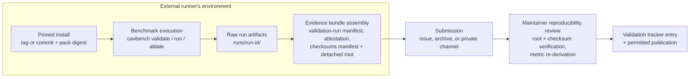

# Design: Independent External Validation Run

Status: Approved for implementation with conditions (tooling scope only)

> **Design approval:** [`docs/program/approvals/M-IVT-1.md`](../program/approvals/M-IVT-1.md)
> records human approval, at reviewed commit
> `38c5e1e8590e17c2798618c0490db7958d7f739d`, scoped to the tooling and a
> maintainer dry run only — not to any real external run, which remains a
> separate, unresolved external-evidence gate. Approval is
> design-specific, not implementation, PR approval, merge authorization,
> or external validation — see the approval record for the exact approved
> and unapproved scope. No implementation has occurred under this
> approval, and no independent run has occurred.

This document designs the process, tooling requirements, and evidence model
for an **independently conducted external benchmark run** of CAV-Bench — the
roadmap outcome "at least one benchmark run conducted outside the core
project team" (`docs/strategy/90-day-engineering-program.md`). It defines
what independence means, what an external runner does, what evidence a run
produces, and what may and may not be claimed afterward.

No independent run has occurred. Nothing in this document is a claim that
one has.

## Executive summary

CAV-Bench's credibility rests on being independently reproducible: an
outside party, without help from the project team beyond public
documentation, installs a pinned version, executes the benchmark against a
pinned scenario pack, and produces an evidence bundle whose integrity and
provenance can be reviewed afterward. This design defines three run
categories (project-team self-run, assisted external run, independently
conducted run), an independence rubric, a runner onboarding workflow, a
validation-run manifest schema, an evidence-bundle layout with an integrity
manifest, a runner attestation, and disclosure levels for publishing the
result. Only the independently conducted category may satisfy the roadmap's
independent-run outcome.

## Problem statement

Today every recorded CAV-Bench run has been executed by the project team.
The reproducibility guide (`docs/reproducibility.md`) documents exact
commands and expected output, but documentation alone does not demonstrate
that an outsider can actually complete a run, nor does it produce evidence
that would let a third party verify that a claimed external run really
happened, on what version, with what configuration, and with what result.
Without a defined evidence model, a future "someone ran it" claim would be
unverifiable — exactly the class of unsupported claim the project's claim
discipline (`docs/strategy/adoption-and-validation-tracking.md`) prohibits.

## Intended users and stakeholders

- **External runners** — engineers, researchers, or evaluators outside the
  project team who execute the benchmark on their own infrastructure.
- **Project maintainers** — review evidence bundles, answer questions within
  the support boundary, and record validation-tracker entries.
- **Downstream readers** — anyone assessing whether CAV-Bench's
  reproducibility claims are supported by evidence rather than assertion.

## Goals

- Define independence precisely enough that a run's category is decidable
  from recorded facts, not from impressions.
- Give an external runner a complete, self-service path from a clean machine
  to a finished evidence bundle.
- Make every run's inputs (version, commit, pack digest, seed,
  configuration, environment) and outputs (traces, evaluations, summaries)
  captured with integrity checks.
- Define what the project may publish about a run, at whose permission, and
  at what level of detail.

## Non-goals

- This design does not recruit runners, and does not claim any runner has
  committed.
- It does not build a hosted results service or leaderboard.
- It does not certify runners or their organizations.
- It does not cover runs of external agents or frameworks beyond what a
  pinned CAV-Bench release already supports; evaluating a new system is the
  hidden-failure-discovery workstream
  (`docs/design/hidden-failure-discovery.md`).
- It does not change evaluator semantics, scenario packs, or metrics.

## Preconditions and dependencies

- A pinned, installable CAV-Bench version (v1.0.0 exists; a run may pin any
  tagged release or exact commit).
- For runs exercising a framework integration, a merged executable
  integration (the LangGraph four-scenario runtime, PR #8 chain) — a
  baseline-profiles-only run has no such dependency.
- The independent-validation tooling milestone in
  `docs/program/implementation-manifest.md` (manifest generator, bundle
  packager, integrity checker) makes the workflow low-friction, but a run
  can be conducted manually against this document before that tooling
  exists.
- Evidence handling follows `docs/program/external-evidence-policy.md`.

## Functional requirements

- **IVR-FR-001** — The documentation must define an onboarding workflow that
  an external runner can complete using only public repository content, from
  environment setup through evidence-bundle submission.
- **IVR-FR-002** — Every validation run must pin the exact CAV-Bench
  version: git tag or commit SHA, package version, and the scenario-pack
  digest reported by `cavbench validate`.
- **IVR-FR-003** — Every validation run must record the execution
  environment: OS and version, CPU architecture, Python version, and the
  resolved dependency set (e.g. `pip freeze` output).
- **IVR-FR-004** — Every validation run must record the full configuration:
  command lines executed, seed(s), pack ID, adapter/profile selection, and
  any non-default options.
- **IVR-FR-005** — The run must produce an evidence bundle containing raw
  artifacts (the complete `runs/<run-id>/` directory: `manifest.json`,
  `traces/`, `evaluations.jsonl`, `summary.json`, `summary.md`) and derived
  artifacts (the validation-run manifest, integrity files, and runner
  attestation defined below).
- **IVR-FR-006** — The evidence bundle must carry the non-recursive
  integrity model defined in [Integrity model](#integrity-model): a
  `checksums.sha256` manifest covering every bundle file except the
  excluded integrity files themselves, plus a detached bundle-root
  checksum over the manifest, so post-hoc modification of any artifact is
  detectable without self-reference.
- **IVR-FR-007** — The bundle must include a signed-in-name runner
  attestation (see [Runner attestation](#runner-attestation)) stating who
  ran it, in what category, with what assistance, and what permissions they
  grant.
- **IVR-FR-008** — The run's category (self-run / assisted / independent)
  must be derivable from the attestation plus the independence rubric, and
  recorded in the validation-run manifest.
- **IVR-FR-009** — A run must end in exactly one terminal state: completed,
  failed, or inconclusive, with the state and its reason recorded.
- **IVR-FR-010** — Maintainers must perform a reproducibility review of a
  submitted bundle: verify integrity in the defined verification order
  (bundle root, manifest format, per-file checksums, no unlisted files),
  re-derive summary metrics from the
  submitted `evaluations.jsonl`, and (for baseline-profile runs on
  `core-v1`) compare against the canonical ablation expectations.
- **IVR-FR-011** — Publication of any run detail must respect the runner's
  recorded disclosure level; nothing beyond that level may be published.

## Non-functional requirements

- An experienced engineer should be able to complete a baseline-profiles
  run, including environment setup and bundle packaging, in a target of
  **2–4 hours**; a framework-integration run in a target of **4–8 hours**.
  These targets are estimates to validate, not commitments.
- The workflow must require no network access during benchmark execution
  itself (matching D-006), only for installation.
- All bundle formats are plain JSON/Markdown/text — reviewable without
  project-specific tooling.
- The support boundary (below) must keep maintainer involvement low enough
  that it does not compromise independence.

## Architecture

## Component responsibilities

- **Onboarding documentation** (this design, plus `docs/reproducibility.md`
  and a future runner quick-start): everything the runner needs, with no
  private channel required.
- **Validation-run manifest** (runner-produced): the run's identity,
  pinning, environment, configuration, category, and terminal state.
- **Integrity files** (runner-produced): `checksums.sha256` over every
  content file, plus the detached `bundle-root.sha256` root (see
  [Integrity model](#integrity-model)).
- **Runner attestation** (runner-authored): identity, independence
  statement, assistance disclosure, permissions.
- **Reproducibility review** (maintainer-performed): integrity and
  consistency verification; never alters the submitted bundle.
- **Validation tracker** (maintainer-maintained, per
  `docs/strategy/adoption-and-validation-tracking.md`): the project-side
  record of the engagement.

## System boundaries

The benchmark run executes entirely inside the runner's environment; the
project team's systems are not involved in producing run truth. The project
team's role is bounded to publishing documentation, answering questions
within the support boundary, and reviewing submitted evidence. The review
step verifies; it never regenerates or repairs runner evidence.

## Trust boundaries

- Everything inside the runner's environment is trusted **to the runner**,
  not to the project: the project's review can verify internal consistency
  (checksums match, metrics re-derive from traces, pack digest matches the
  pinned version) but cannot prove the runner's environment description is
  accurate. That residual trust is exactly what the attestation carries, and
  why the run category is recorded rather than asserted away.
- The evaluator-independence rule is unchanged: within the run, committed
  effects come only from the benchmark environment, oracle, state history,
  and ledger. An external runner gains no new channel to influence scoring.
- Maintainer assistance is a trust-boundary event: any assistance beyond the
  support boundary demotes the run's category (see the rubric below), and
  the attestation must disclose all assistance received.

## Data and evidence flow

1. Runner selects a pinned version and records tag/commit before installing.
2. Runner installs and runs `cavbench doctor` and
   `cavbench validate --pack core-v1`, capturing output (including the pack
   digest).
3. Runner executes the planned run(s) (`cavbench run` / `cavbench ablate`)
   with recorded seeds and options.
4. Runner assembles the bundle: raw `runs/` output + validation-run
   manifest + attestation, then generates `checksums.sha256` and the
   detached `bundle-root.sha256` last, in that order (see
   [Integrity model](#integrity-model)).
5. Runner submits the bundle (public GitHub issue attachment or archive
   link for public runs; a private channel for restricted runs).
6. Maintainer verifies integrity in the defined order (root, then
   manifest, then per-file), re-derives metrics, records a tracker
   entry, and publishes only what the disclosure level permits.

## Interfaces or APIs

No new runtime APIs are required. The run uses the existing CLI surface
(`cavbench doctor | list | validate | run | ablate | replay | report`). The
new interfaces are document schemas:

### Validation-run manifest schema

Documented schema (JSON), proposed as `validation-run-v1`. This is a
documentation-level schema; a machine-validated JSON Schema file is an
implementation deliverable of the independent-validation tooling milestone.

| Field | Type | Meaning |
|---|---|---|
| `manifest_schema` | string | `"validation-run-v1"`. |
| `run_label` | string | Runner-chosen label for the whole validation run. |
| `run_category` | enum | `project_self_run` \| `assisted_external` \| `independent_external`. |
| `runner` | object | `name`, `affiliation` (optional), `contact` (optional per disclosure level). |
| `cavbench_version` | object | `package_version`, `git_tag` (optional), `git_commit` SHA. |
| `pack` | object | `pack_id`, `pack_version`, `digest` as printed by `cavbench validate`. |
| `environment` | object | `os`, `os_version`, `arch`, `python_version`, `dependency_freeze` (path to captured freeze file in the bundle). |
| `configuration` | object | `commands` (ordered list of exact command lines), `seeds`, `adapters_or_profiles`, `non_default_options`. |
| `started_at` / `finished_at` | string | ISO-8601 timestamps, runner's clock. |
| `terminal_state` | enum | `completed` \| `failed` \| `inconclusive`. |
| `terminal_state_reason` | string | Required for `failed` and `inconclusive`. |
| `artifacts` | list | Relative paths of raw run directories included in the bundle. |
| `assistance_received` | list | Every project-team interaction: date, channel, summary. Empty list is a positive assertion of no assistance. |
| `issues_encountered` | list | Problems hit, with links to filed issues where applicable. |
| `disclosure_level` | enum | See [Disclosure levels](#privacy-and-disclosure-considerations). |
| `attestation` | string | Relative path of the attestation document. |
| `integrity_manifest` | string | Relative path of `checksums.sha256`. Note: the bundle-root checksum is **not** a manifest field — the manifest is itself covered by `checksums.sha256`, so embedding the root would be self-referential. The root lives only in the detached `bundle-root.sha256` file and in external records. |

### Integrity model

The bundle's integrity design is deliberately non-recursive: a flat
checksum manifest over content files, and a single detached root over
that manifest. This model is shared by every evidence bundle in the
program (validation runs, hidden-failure baselines, retest bundles).

**Coverage.** `checksums.sha256`, at the bundle root directory, lists a
SHA-256 checksum for **every regular file in the bundle except**:
`checksums.sha256` itself, `bundle-root.sha256`, and any detached
signature file (`checksums.sha256.sig`). Nothing else is exempt; empty
directories are not represented (and therefore not integrity-protected —
bundles must not carry meaning in empty directories).

**Format.** One line per file:
`<lowercase-hex-sha256><space><space><relative-path>` — the
GNU-`sha256sum`-compatible two-space form. Paths are relative to the
bundle root, use `/` separators on all platforms, contain no leading
`./`, and must not contain newline characters. Lines are ordered by
byte-wise lexicographic comparison of the UTF-8-encoded relative path
(no locale-dependent collation). The file is UTF-8 without BOM, LF line
endings only, exactly one line per entry, and ends with a single
trailing LF. Checksums are computed over exact file bytes — generators
must never normalize the line endings or encoding of the *content*
files they hash.

**Bundle root.** `bundle-root.sha256` contains one line: the
lowercase-hex SHA-256 of the exact bytes of `checksums.sha256`, in the
same two-space format (`<hex>  checksums.sha256`), UTF-8, LF, single
trailing newline. This root value — a single hash — is what external
records store (finding records, version-controlled references, tracker
entries). Because the manifest's format above is fully canonical, the
root is deterministic: two independently generated manifests over
identical file trees are byte-identical, and so are their roots. A
Merkle tree is not required at these bundle sizes; if a future revision
needs partial verification of very large bundles, a Merkle-root variant
may replace the flat root through a documented format-version bump.

**Archive normalization.** Integrity binds the file *tree*, not any
archive representation of it. When a bundle is transported as an archive
(`.tar.gz`, `.zip`), verification is performed over the extracted tree;
archive-level bytes are unconstrained. Archive creators are encouraged
(not required) to produce deterministic archives — sorted entries, fixed
timestamps, no owner/group metadata — but no integrity claim ever rests
on the archive file's own hash. Extraction for verification must use
path-traversal-safe tooling and must reject absolute paths and `..`
components.

**Optional signature.** A runner may add a detached signature
(`checksums.sha256.sig`, e.g. GPG or SSH signature) over the exact bytes
of `checksums.sha256`. The signature strengthens attribution of the
attestation; it does not replace the recorded root, and its absence is
not a defect. Signature files are excluded from coverage (above) and
verified, when present, after the root check.

**Generation order.** Assemble all content files first; generate
`checksums.sha256`; generate `bundle-root.sha256`; optionally sign.
Any later change to any content file requires regenerating both files
(and re-signing), which changes the root — that is the tamper-evidence
property working, and is why external records store the root at freeze
time.

**Verification order.** 1) Hash `checksums.sha256` and compare against
the externally recorded root (falling back to `bundle-root.sha256` only
when no external record exists — the detached file inside the bundle
proves internal consistency, not freeze-time provenance); 2) verify the
signature if present; 3) parse the manifest, rejecting format
violations (ordering, encoding, duplicates); 4) hash every listed file
and compare; 5) enumerate the tree and confirm no unlisted files exist
beyond the three excluded names.

**Tamper detection.** Any failure — root mismatch, signature failure,
format violation, per-file mismatch, missing listed file, or unlisted
extra file — makes the bundle **integrity-failed**: the run's review
outcome is `inconclusive`, nothing in the bundle may be cited as
evidence, and recovery is a fresh run producing a fresh bundle, never a
repaired one.

### Runner attestation

A short, human-authored statement in the bundle, in the runner's name,
covering: who they are; that they conducted the run themselves; every form
of assistance received (or that none was); that artifacts are unmodified
outputs of the recorded commands; which run category they assert; and what
publication and attribution permissions they grant. The attestation is
evidence class "independent external evidence" (or "assisted external
evidence") under `docs/program/external-evidence-policy.md`.

## State and lifecycle model

Run lifecycle: `planned → environment_prepared → executing → bundling →
submitted → under_review → recorded`, with terminal run states:

- **completed** — all planned commands finished and produced parseable
  artifacts (this is about execution, not about the subject "passing":
  a run whose evaluated profiles show validity failures is still
  `completed`).
- **failed** — execution could not finish (installation failure, crash,
  unrecoverable error) and the runner stopped.
- **inconclusive** — execution finished but artifacts are unusable for
  review (missing files, checksum mismatch, unparseable output, or a
  category dispute that cannot be resolved).

A `failed` or `inconclusive` run is still valuable evidence — it must be
recorded in the tracker (it is exactly the "onboarding acceptable?" signal
the 14-day sprint asks for) and should produce filed issues.

### Run categories and independence rubric

| Category | Definition | May satisfy the roadmap independent-run outcome? |
|---|---|---|
| **Project-team self-run** | Conducted by a project maintainer or under a maintainer's direction, on any infrastructure. | No. |
| **Assisted external run** | Conducted by an external party, but with project-team assistance beyond the support boundary: live debugging, environment setup performed by the team, custom patches supplied out-of-band, or the team executing any step. | No — but it is a valuable Level-2 reproduction signal and a documentation-gap detector. |
| **Independently conducted run** | Conducted by an external party using only public repository content, with any project contact limited to the support boundary and fully disclosed in the attestation. | Yes — the only category that may. |

Independence criteria (all must hold for `independent_external`):

1. The runner is not a project maintainer, is not acting under project
   direction, and selected their own environment.
2. Every executed command was chosen and run by the runner.
3. No non-public code, configuration, or data was supplied by the project.
4. All project contact fell within the support boundary and is disclosed.
5. The runner authored the attestation themselves.

Eligible runner personas (from the program's target groups): framework or
protocol engineers, commerce/service architects, security and assurance
practitioners, and researchers attempting a methodology reproduction. A
persona is a description, not a gate — any external party meeting the
criteria qualifies.

### Support boundary

Within bounds (does not demote independence): answering questions in public
issues; fixing documentation defects the runner reports (which the runner
then picks up as a normal published change); clarifying intended behavior.
Out of bounds (demotes to assisted): screen-sharing or live debugging;
writing or editing the runner's configuration; supplying unpublished
patches; running any step for them. When in doubt, record the interaction
in `assistance_received` and let the review classify it.

## Failure modes

- Installation or environment failure on the runner's platform → `failed`
  run; file an issue; the failure is itself adoption-barrier evidence.
- Pack digest mismatch against the pinned version → stop; the install is
  not the claimed version; record as `inconclusive` if unresolvable.
- Non-deterministic or non-reproducing output (summary metrics differ from
  `docs/reproducibility.md` expectations for the same version/seed) → do
  not "fix" locally; capture the bundle as-is and file an issue. This is a
  **stop condition** for the project (canonical results unexpectedly
  changing, per `CLAUDE.md`).
- Integrity failure discovered at review (root mismatch, manifest format
  violation, per-file mismatch, or unlisted files) → review outcome is
  `inconclusive`; a fresh run is required, not a repaired bundle.
- Category dispute (assistance not disclosed, or disclosed assistance
  arguably out of bounds) → resolve conservatively: the lower category
  applies.

## Recovery behavior

A failed run may be retried by the runner at will; each attempt is a new
run with a new manifest (previous failed manifests are kept — they are the
record of onboarding friction). The project team responds to filed issues
through normal public development; a fix that unblocks a runner ships as a
published release or commit the runner then re-pins, keeping the retry
independent.

## Security considerations

- Runners must never need credentials, tokens, or private endpoints; the
  benchmark is local and network-free at execution time (D-006).
- Bundles must be reviewed before publication for accidentally captured
  secrets (shell history, environment variables in freeze output, home-path
  usernames the runner did not intend to disclose).
- Submitted archives are untrusted input: review them as data (extract with
  path-traversal-safe tooling; never execute contained code).

## Privacy and disclosure considerations

Disclosure levels, chosen by the runner, recorded in the manifest:

| Level | What the project may publish |
|---|---|
| `public_named` | Full bundle, runner name and affiliation, quotations with approval. |
| `public_anonymous` | Full bundle and results with runner identity credibly anonymized. |
| `summary_only` | Aggregate result and category; no raw artifacts, no identity. |
| `private` | Tracker entry only (restricted records); nothing published. |

Runner identity and correspondence are restricted project records until the
runner grants a level that permits publication
(`docs/strategy/adoption-and-validation-tracking.md`). A disclosure level
can be raised later by the runner, never lowered retroactively by the
project once published.

## Determinism and reproducibility requirements

- The run must pin version, pack digest, and seeds such that the project
  team (or any third party at a sufficient disclosure level) can re-execute
  the identical configuration and compare outputs.
- For baseline-profile runs of `core-v1`, summary metrics must be
  bit-comparable to the canonical expectations for that version; any
  deviation is a finding, never something to normalize away.
- The checksum manifest and its externally recorded bundle root make the
  bundle tamper-evident from the moment of assembly.

## Observability and audit evidence

The bundle is the audit trail: raw traces, evaluations, and summaries; the
validation-run manifest; captured command output for `doctor` and
`validate`; the dependency freeze; the attestation; `checksums.sha256`;
and `bundle-root.sha256`. The project-side tracker entry records review results and
category determination, with a pointer to where the bundle is archived.

## Test strategy

For this design (documentation): relative-link validation and terminology
consistency. For the future tooling milestone: unit tests for checksum-manifest
generation (canonical ordering, encoding, exclusions), root generation,
and the full verification order; an integration test that packages a
real `cavbench ablate` output into a bundle and round-trips verification;
a negative test that a modified file fails integrity review. A project-team
**dry run** — a maintainer following the runner documentation exactly, on a
clean machine, producing a `project_self_run` bundle — is the rehearsal
gate before inviting any external runner, and must itself be recorded as
`project_self_run`, never counted as external.

## Acceptance criteria

This design is complete when:

1. A maintainer dry run produces a conforming bundle end-to-end using only
   public documentation.
2. The rubric classifies the dry run as `project_self_run` without judgment
   calls.
3. Review of the dry-run bundle passes the full verification order
   (root, manifest, per-file, no unlisted files) and re-derives summary
   metrics from `evaluations.jsonl`.
4. An external reviewer of this document can state what they would have to
   do to conduct an independent run, without asking clarifying questions.

The roadmap outcome itself is accepted only when a bundle with
`run_category: independent_external` passes reproducibility review — an
external, non-automatable event.

## Delivery phases

1. **Design approval** (this document, via human review of the docs PR).
2. **Tooling** (separate milestone `M-IVT-1`,
   `docs/program/implementation-manifest.md`): bundle packager,
   checksum-manifest and bundle-root generator/verifier, manifest
   template, runner quick-start.
3. **Rehearsal**: maintainer dry run; fix friction found.
4. **External availability**: publish the runner quick-start; support
   boundary in effect.
5. **First external run**: review, record, publish per disclosure level.

## Rollback or abandonment criteria

Abandon or rework if the dry run shows the workflow cannot be completed in
a reasonable multiple of the target time; if the independence rubric proves
undecidable on real cases; or if external feedback shows the evidence
bundle demands more than external runners will accept (in which case
simplify the bundle, not the independence criteria — the criteria are the
point). Abandonment leaves the repository unchanged except this document's
status.

## Open questions

1. Where should public bundles be archived long-term — repository
   `validation-runs/` directory, GitHub release assets, or Zenodo? (Affects
   `docs/design/follow-up-release.md`.)
2. Should the attestation support cryptographic signing (e.g. a signed git
   note or GPG signature) or is a named written statement sufficient for
   this program stage? Proposed: named statement now; signing optional.
3. Is `summary_only` disclosure useful enough to keep, given it produces
   evidence the project can barely use publicly?
4. Should a framework-integration run require a specific merged adapter
   version, or is "any tagged version containing the adapter" sufficient
   pinning?

## Explicit claims and non-claims

Claims this design supports once executed: "the benchmark was run
independently by <runner> on <version> with <result>, evidence archived at
<location>" — at the runner's disclosure level.

Non-claims, regardless of outcome: no independent run has occurred as of
this document; no runner has committed to one; a completed independent run
is not an endorsement, adoption, certification, or validation of
CAV-Bench's methodology — it demonstrates reproducibility only; and
assisted runs will never be presented as independent.
