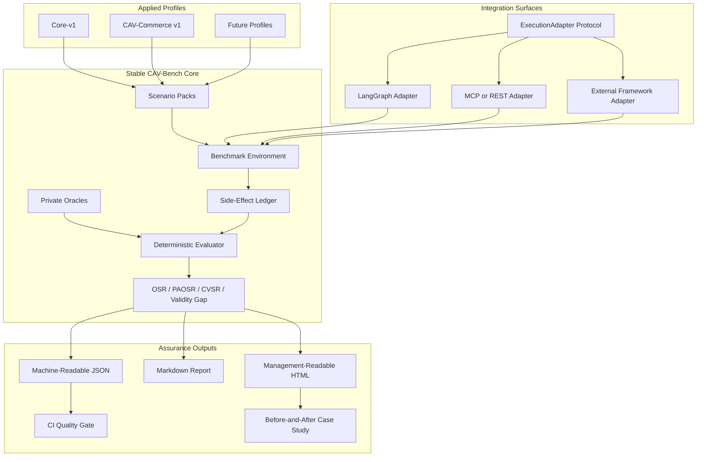

# Visual Architecture Roadmap

```mermaid
flowchart TB
    subgraph Core[Stable CAV-Bench Core]
        SC[Scenario Packs]
        BO[Private Oracles]
        ENV[Benchmark Environment]
        LED[Side-Effect Ledger]
        EVA[Deterministic Evaluator]
        MET[OSR / PAOSR / CVSR / Validity Gap]
        SC --> ENV
        BO --> EVA
        ENV --> LED
        LED --> EVA
        EVA --> MET
    end

    subgraph Integration[Integration Surfaces]
        PROTO[ExecutionAdapter Protocol]
        LG[LangGraph Adapter]
        MCP[MCP or REST Adapter]
        EXT[External Framework Adapter]
        PROTO --> LG
        PROTO --> MCP
        PROTO --> EXT
    end

    subgraph Profiles[Applied Profiles]
        CORE[Core-v1]
        COM[CAV-Commerce v1]
        FUT[Future Profiles]
    end

    subgraph Outputs[Assurance Outputs]
        JSON[Machine-Readable JSON]
        MD[Markdown Report]
        HTML[Management-Readable HTML]
        CI[CI Quality Gate]
        CASE[Before-and-After Case Study]
    end

    LG --> ENV
    MCP --> ENV
    EXT --> ENV
    CORE --> SC
    COM --> SC
    FUT --> SC
    MET --> JSON
    MET --> MD
    MET --> HTML
    JSON --> CI
    HTML --> CASE
```
