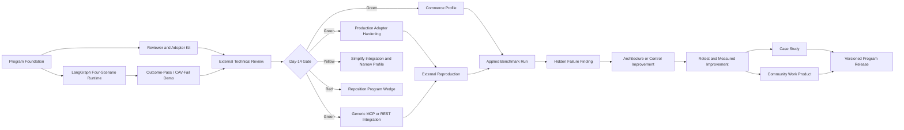

# Dependency Graph

```mermaid
flowchart LR
    A[Program Foundation] --> B[LangGraph Four-Scenario Runtime]
    A --> C[Reviewer and Adopter Kit]
    B --> D[Outcome-Pass / CAV-Fail Demo]
    C --> E[External Technical Review]
    D --> E
    E --> G{Day-14 Gate}

    G -->|Green| H[Production Adapter Hardening]
    G -->|Green| I[Commerce Profile]
    G -->|Green| J[Generic MCP or REST Integration]
    G -->|Yellow| K[Simplify Integration and Narrow Profile]
    G -->|Red| L[Reposition Program Wedge]

    H --> M[External Reproduction]
    I --> N[Applied Benchmark Run]
    J --> M
    M --> N
    N --> O[Hidden Failure Finding]
    O --> P[Architecture or Control Improvement]
    P --> Q[Retest and Measured Improvement]
    Q --> R[Case Study]
    Q --> S[Community Work Product]
    R --> T[Versioned Program Release]
    S --> T
```
