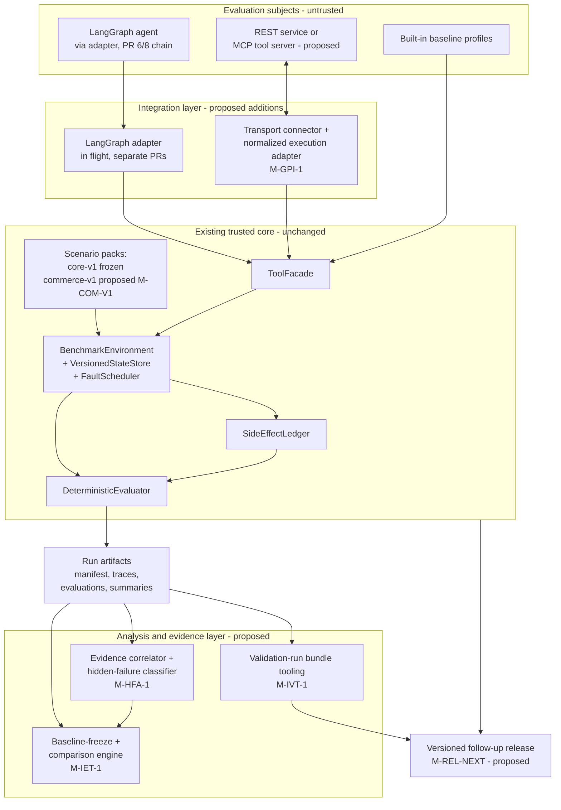

# Future System Architecture

Status: Proposed

How the designed future components
([`../design/future-workstreams-index.md`](../design/future-workstreams-index.md))
attach to the existing CAV-Bench core. The organizing rule is unchanged
from [`../architecture.md`](../architecture.md): everything that produces
commit truth (environment, ledger, oracle, evaluator) is existing,
trusted, benchmark-owned code that **none of the new work modifies**. New
components attach only at the established extension points — the
`ExecutionAdapter` protocol, the `ScenarioPack` loader, and read-only
consumption of run artifacts.

Everything outside the "existing trusted core" group is proposed, not
built. The LangGraph adapter (PR #6/#8 chain) is in flight under its own
review and shown for context.

## Reading the diagram

**Subjects (top)** are untrusted by definition — they are what is being
evaluated. The baseline profiles are the existing deterministic
strategies; the LangGraph agent path and protocol-connected services are
the two integration on-ramps.

**Integration layer**: both the in-flight LangGraph adapter and the
proposed generic protocol connector
([`../design/generic-protocol-integration.md`](../design/generic-protocol-integration.md))
terminate at the same place — the existing `ToolFacade`. Neither gets a
private path to state, ledger, or evaluator; that is what keeps
"the system under evaluation must never grade itself" true across every
integration.

**Trusted core** is drawn without change markers because no future
workstream changes it. `commerce-v1`
([`../design/commerce-v1-profile.md`](../design/commerce-v1-profile.md))
appears inside the core group because a scenario pack is data loaded by
existing code — it adds domain content, not new trust.

**Analysis and evidence layer**: the validation-run tooling
([`../design/independent-validation-run.md`](../design/independent-validation-run.md)),
hidden-failure pipeline
([`../design/hidden-failure-discovery.md`](../design/hidden-failure-discovery.md)),
and improvement-comparison tooling
([`../design/improvement-case-study.md`](../design/improvement-case-study.md))
are strictly **downstream, read-only consumers of run artifacts**. The
arrows into them are one-directional on purpose: nothing in this layer
can write back into evaluation. The correlator/classifier annotates and
selects; the comparison engine diffs; the bundle tooling packages and
checksums.

**Release** ([`../design/follow-up-release.md`](../design/follow-up-release.md))
consumes everything — merged core + integrations + packs, plus whatever
externally-evidenced artifacts the analysis layer has produced — through
the release gate, which blocks on unsubstantiated claims
([`../program/external-evidence-policy.md`](../program/external-evidence-policy.md)).
