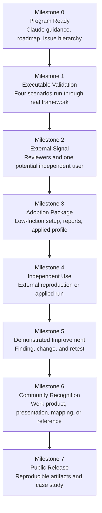

# Milestone Map

```mermaid
flowchart TB
    M0[Milestone 0\nProgram Ready\nClaude guidance, roadmap, issue hierarchy]
    M1[Milestone 1\nExecutable Validation\nFour scenarios run through real framework]
    M2[Milestone 2\nExternal Signal\nReviewers and one potential independent user]
    M3[Milestone 3\nAdoption Package\nLow-friction setup, reports, applied profile]
    M4[Milestone 4\nIndependent Use\nExternal reproduction or applied run]
    M5[Milestone 5\nDemonstrated Improvement\nFinding, change, and retest]
    M6[Milestone 6\nCommunity Recognition\nWork product, presentation, mapping, or reference]
    M7[Milestone 7\nPublic Release\nReproducible artifacts and case study]

    M0 --> M1 --> M2 --> M3 --> M4 --> M5 --> M6 --> M7
```
