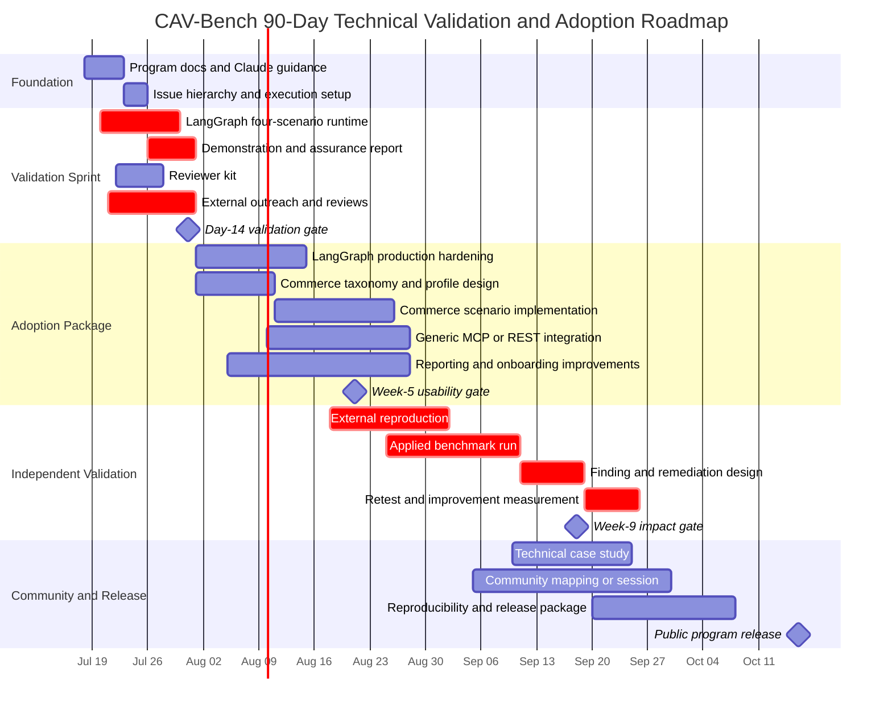

# Program Gantt Chart

```mermaid
gantt
    title CAV-Bench 90-Day Technical Validation and Adoption Roadmap
    dateFormat  YYYY-MM-DD
    axisFormat  %b %d

    section Foundation
    Program docs and Claude guidance       :a1, 2026-07-18, 5d
    Issue hierarchy and execution setup    :a2, after a1, 3d

    section Validation Sprint
    LangGraph four-scenario runtime        :crit, b1, 2026-07-20, 10d
    Demonstration and assurance report     :crit, b2, 2026-07-26, 6d
    Reviewer kit                           :b3, 2026-07-22, 6d
    External outreach and reviews          :crit, b4, 2026-07-21, 11d
    Day-14 validation gate                 :milestone, b5, 2026-07-31, 0d

    section Adoption Package
    LangGraph production hardening         :c1, 2026-08-01, 14d
    Commerce taxonomy and profile design   :c2, 2026-08-01, 10d
    Commerce scenario implementation       :c3, after c2, 15d
    Generic MCP or REST integration        :c4, 2026-08-10, 18d
    Reporting and onboarding improvements  :c5, 2026-08-05, 23d
    Week-5 usability gate                  :milestone, c6, 2026-08-21, 0d

    section Independent Validation
    External reproduction                  :crit, d1, 2026-08-18, 15d
    Applied benchmark run                  :crit, d2, 2026-08-25, 17d
    Finding and remediation design         :crit, d3, after d2, 8d
    Retest and improvement measurement     :crit, d4, after d3, 7d
    Week-9 impact gate                     :milestone, d5, 2026-09-18, 0d

    section Community and Release
    Technical case study                   :e1, 2026-09-10, 15d
    Community mapping or session           :e2, 2026-09-05, 25d
    Reproducibility and release package    :e3, 2026-09-20, 18d
    Public program release                 :milestone, e4, 2026-10-16, 0d
```
