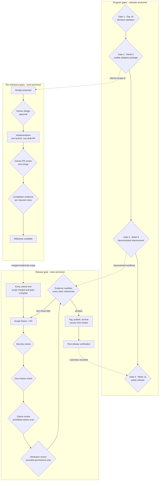

# Release and Adoption Gates

Status: Proposed

The gates between "designed" and "publicly released," combining the
90-day program's four calendar gates
([`../strategy/90-day-engineering-program.md`](../strategy/90-day-engineering-program.md))
with the per-milestone gate lifecycle
([`../program/gate-state.md`](../program/gate-state.md)) and the release
gate's blocking checks
([`../design/follow-up-release.md`](../design/follow-up-release.md)).
Program gates ask "is the program on track?"; milestone gates ask "may
this specific work proceed?"; the release gate asks "is every claim in
this release substantiated?" All three must pass independently — no gate
substitutes for another.

## Reading the diagram

**Program gates (top)** are the roadmap's green/yellow/red decision
points. They govern *program direction* — whether to expand, narrow, or
reposition — and none of them approves any specific implementation or
claim. Passing Gate 1 does not approve a milestone; failing it doesn't
un-merge one.

**Per-milestone gates (middle)** are the `gate-state.md` lifecycle
compressed to its four decision points. The two diamonds marked "human"
(`MS2`, `MS4`) are transitions automation may never self-authorize; `MS5`
is the completion-evidence check, where the required evidence *class*
([`../program/external-evidence-policy.md`](../program/external-evidence-policy.md))
decides — merged code alone completes nothing whose outcome is external.

**Release gate (bottom)** is deliberately a loop: any failed review sends
the release back to a new candidate, and the final diamond — the evidence
manifest — is the blocking property this whole package exists to
guarantee: **a release cannot be published while any external-evidence or
attribution claim in its artifacts lacks a recorded reference.**
Rewording or removing a claim is the normal, non-incident way through
this gate; fabricating a reference is prohibited at every layer above it.

**The dashed arrows** show how the layers feed each other without
collapsing into one another: Gate-2 feedback shapes which designs are
worth proposing; completed milestones supply the release's entry
criteria; Gate-3's improvement evidence (if it exists by freeze) is what
the evidence manifest would reference for any improvement claim; and
post-release verification is what lets Gate 4 record the program outcome
honestly.
