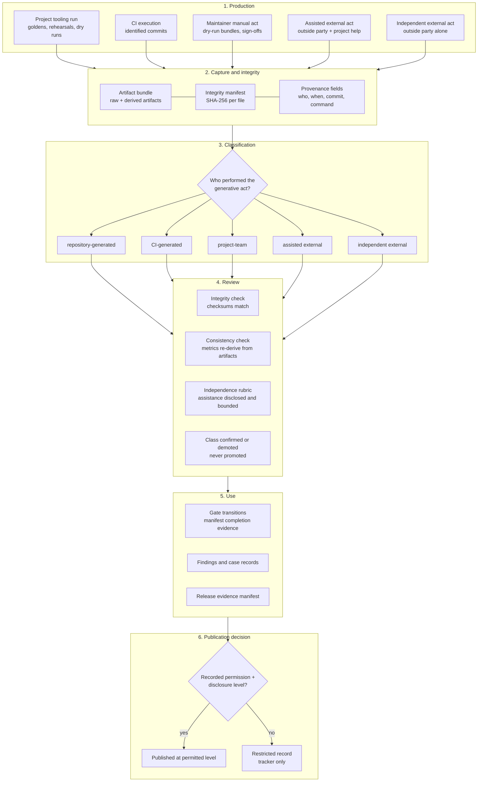

# Validation and Evidence Lifecycle

Status: Proposed

How a piece of validation evidence comes into existence, gets classified,
and earns (or is denied) publication — the lifecycle enforced by
[`../program/external-evidence-policy.md`](../program/external-evidence-policy.md)
and consumed by gate transitions
([`../program/gate-state.md`](../program/gate-state.md)) and the release
gate ([`../design/follow-up-release.md`](../design/follow-up-release.md)).

The lifecycle's central property: **the same artifact pipeline serves
every producer, but the evidence class is fixed by who performed the
generative act** — project tooling can package and verify anything, yet
only an outside party's independent act can produce independent external
evidence, and only a recorded permission can unlock naming anyone.

## Reading the diagram

**Production (1)** is where class is *determined*, even though it is only
*recorded* later: the five producer lanes map one-to-one onto the
evidence classes of the external-evidence policy. A rehearsal run by
project tooling can be flawless and still never move right of lane 1's
class — quality does not change provenance.

**Capture (2)** is identical for everyone: raw artifacts, per-file
checksums, and the class-specific minimum provenance fields. Uniform
capture is what makes later review mechanical instead of forensic.

**Classification (3)** asks exactly one question. Note what it does not
ask: not "how good is the evidence," not "who possesses the file."

**Review (4)** can only confirm or **demote** a class (e.g. independent →
assisted when undisclosed assistance surfaces). There is no promotion
path — an executor or maintainer cannot argue project-generated evidence
up into external evidence. This one-way arrow is the lifecycle's
anti-fabrication property.

**Use (5)**: gate transitions and manifest completion-evidence
requirements name the class they need; a lower class never satisfies a
requirement for a higher one (a dry run cannot complete the
independent-run outcome; a synthetic demonstration cannot complete a
hidden-failure discovery).

**Publication (6)** is a separate decision from validity: perfectly valid
independent evidence stays a restricted record until a recorded
permission at a sufficient disclosure level exists. Permission evidence
is itself evidence, with its own provenance fields.
