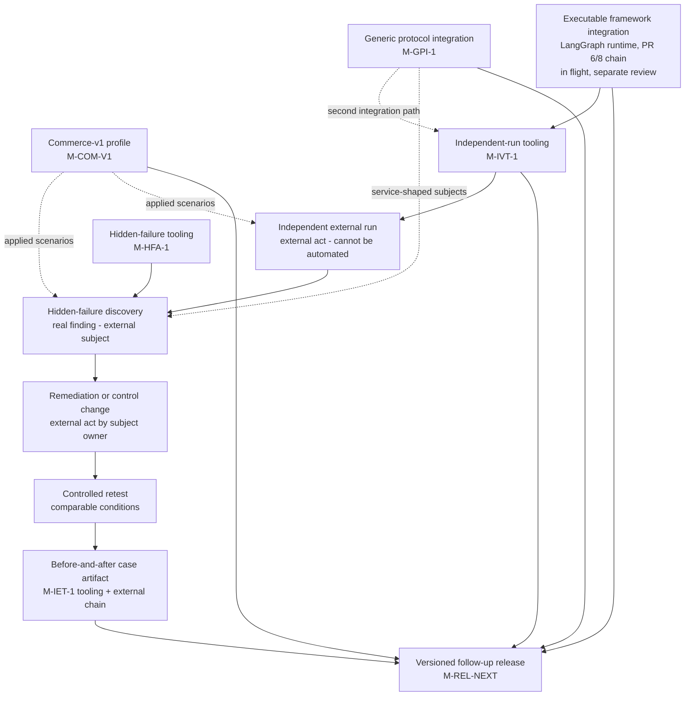

# Workstream Dependency Map

Status: Proposed

Which future workstreams gate which — the ordering that the
[`../program/implementation-manifest.md`](../program/implementation-manifest.md)
queue and its initial statuses encode. The spine of the map is the
evidence chain the 90-day roadmap requires: an executable integration
enables an independent external run, which enables hidden-failure
discovery in a real subject, which enables a remediation, a controlled
retest, and a before-and-after case — all of which feed the versioned
release.

## Reading the diagram

**The spine (solid arrows, top to bottom)** is the roadmap's required
evidence chain:

executable framework integration → independent external run →
hidden-failure discovery → remediation or control change → controlled
retest → before-and-after case artifact → versioned release.

Boxes on the spine alternate between **buildable** things (tooling
milestones, in `M-…` labels) and **external acts** that no amount of
building can produce: the independent run, the real finding (which, to
satisfy the roadmap outcome, must be a validated, reproduced finding of
`primary_class: hidden_invalid_commit` —
[`../design/hidden-failure-discovery.md`](../design/hidden-failure-discovery.md),
HFD-FR-006a), the subject-owner's remediation. Those external boxes are why several
manifest entries park at `VALIDATING` or `BLOCKED_EXTERNAL_INPUT` even
after their tooling merges
([`../program/gate-state.md`](../program/gate-state.md)).

**Commerce-v1 and the generic protocol integration (left column, dashed
arrows)** feed applied validation — richer scenarios for runs and
discoveries, a second on-ramp for service-shaped subjects — **without
being prerequisites for every possible external run**: an independent run
on `core-v1` with the framework integration (or even baseline profiles)
satisfies the independent-run outcome with neither of them. Dashed
arrows mean "enriches," solid arrows mean "gates."

**Everything converges on the release**, but through the release gate:
the release ships whatever subset is actually merged and evidenced at
freeze time, and its claims are limited to that subset
([`../design/follow-up-release.md`](../design/follow-up-release.md)).

The in-flight LangGraph chain (PR #6/#8) appears as the spine's root but
is governed by its own review, not by this queue — no future-workstream
executor touches it
([`../program/pr-and-branch-strategy.md`](../program/pr-and-branch-strategy.md)).
