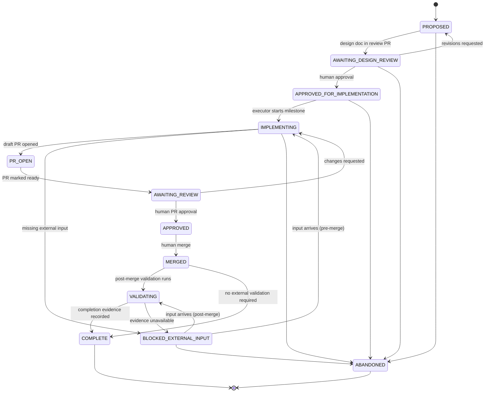

# Gate State — Milestone Lifecycle

Status: Proposed

Defines the lifecycle states used by
[`implementation-manifest.md`](implementation-manifest.md), the
transitions between them, who or what may authorize each transition, the
evidence a transition requires, and what is prohibited in each state.
The Fable execution contract
([`fable-execution-contract.md`](fable-execution-contract.md)) is bound
by these definitions.

**The core rule:** an automated executor may never self-authorize a
transition into `APPROVED_FOR_IMPLEMENTATION`, `APPROVED`, or `COMPLETE`,
and may never manufacture the human or external evidence those
transitions require. Where the tables below say "human maintainer" or
"external evidence," automation may *prepare* the transition request and
*record* an authorized transition, but the authorization itself must be a
recorded human or external act
([`external-evidence-policy.md`](external-evidence-policy.md)).

## State machine

Any pre-merge state may also move to `ABANDONED` by human decision;
`COMPLETE` and `ABANDONED` are terminal (reopening work means a new
milestone entry).

## State definitions

### PROPOSED

- **Meaning:** A design exists or is being drafted; nothing is approved.
- **Allowed transitions:** → `AWAITING_DESIGN_REVIEW` (design document
  complete and submitted in a docs PR); → `ABANDONED`.
- **Authorized by:** Anyone may draft; submitting for review is a
  maintainer act.
- **Required evidence:** The design document itself, `Status: Proposed`.
- **Prohibited:** Any implementation of the milestone; describing the
  milestone as planned-and-approved.

### AWAITING_DESIGN_REVIEW

- **Meaning:** The design is under human review (typically as a
  documentation PR).
- **Allowed transitions:** → `APPROVED_FOR_IMPLEMENTATION`; → `PROPOSED`
  (revisions); → `ABANDONED`.
- **Authorized by:** Transition **out** requires a human maintainer's
  recorded review decision. Automation may not approve.
- **Required evidence:** A design-approval record in the format defined
  in [Design-approval record format](#design-approval-record-format).
- **Prohibited:** Implementation; treating merge of a documentation PR —
  including the PR that introduced this document — as design approval.
  A docs PR carrying several designs approves **none** of them when
  merged: each design needs its own approval record.

### APPROVED_FOR_IMPLEMENTATION

- **Meaning:** A human approved this specific design for implementation;
  the milestone is eligible for the execution queue when its dependency
  milestones permit.
- **Allowed transitions:** → `IMPLEMENTING`; → `ABANDONED`.
- **Authorized by:** Entry: human only. Exit to `IMPLEMENTING`: the
  executor (automated or human), only after verifying dependencies and
  merge prerequisites in the manifest.
- **Required evidence:** The design-approval record (format below);
  design document status updated to reflect approval (in a normal
  committed change referencing the record).
- **Prohibited:** Starting implementation while a dependency milestone is
  unmerged/incomplete; implementation under an approval whose
  `conditions` are unmet or whose reviewed commit SHA no longer matches
  a materially revised design (re-review required); scope beyond the
  approved design.

### IMPLEMENTING

- **Meaning:** Work is happening on the milestone's dedicated branch.
- **Allowed transitions:** → `PR_OPEN`; → `BLOCKED_EXTERNAL_INPUT`;
  → `ABANDONED`.
- **Authorized by:** The executor.
- **Required evidence:** The milestone branch exists per
  [`pr-and-branch-strategy.md`](pr-and-branch-strategy.md); journal
  checkpoints per
  [`resume-and-recovery-protocol.md`](resume-and-recovery-protocol.md).
- **Prohibited:** Touching other milestones' branches or open PRs;
  merging anything; editing golden results to pass tests; exceeding the
  design's allowed actions.

### PR_OPEN

- **Meaning:** A draft PR for the milestone exists.
- **Allowed transitions:** → `AWAITING_REVIEW` (PR marked ready);
  → `IMPLEMENTING` (more work on the same branch).
- **Authorized by:** The executor opens the draft; **marking ready for
  review is a human decision** unless the manifest entry explicitly
  delegates it.
- **Required evidence:** Draft PR URL; full required validation results
  recorded in the PR body.
- **Prohibited:** Merge; starting the next milestone.

### AWAITING_REVIEW

- **Meaning:** A human is reviewing the milestone PR.
- **Allowed transitions:** → `APPROVED`; → `IMPLEMENTING` (changes
  requested).
- **Authorized by:** Human reviewer only.
- **Required evidence:** PR review record.
- **Prohibited:** Executor self-review; force-pushing over reviewed
  commits without noting it.

### APPROVED

- **Meaning:** A human approved the PR; it is mergeable but unmerged.
- **Allowed transitions:** → `MERGED`.
- **Authorized by:** Entry: human review approval only. Merge: human
  only.
- **Required evidence:** Approving review on the PR.
- **Prohibited:** Automated merge — merging is always a human act in
  this program.

### MERGED

- **Meaning:** The milestone PR is merged to its base.
- **Allowed transitions:** → `VALIDATING` (completion evidence requires
  post-merge or external validation); → `COMPLETE` (the manifest entry
  defines no external completion evidence).
- **Authorized by:** Human merges; the executor records the state.
- **Required evidence:** Merge commit SHA; CI green on the base branch.
- **Prohibited:** Declaring program outcomes achieved merely because
  code merged.

### BLOCKED_EXTERNAL_INPUT

- **Meaning:** Progress requires input the project cannot generate:
  human approval, an external runner, owner consent, permission grants,
  or third-party evidence.
- **Allowed transitions:** → `IMPLEMENTING` or → `VALIDATING` when the
  input arrives; → `ABANDONED`.
- **Authorized by:** Entry: the executor (must record exactly what is
  awaited). Exit: only upon the recorded arrival of the named input.
- **Required evidence:** A journal entry naming the awaited input, from
  whom, requested when; on exit, the input's evidence reference.
- **Prohibited:** Simulating, fabricating, or "assuming" the awaited
  input; silently proceeding on a different milestone that shares the
  same block.

### VALIDATING

- **Meaning:** Merged work awaits its completion evidence (e.g. a real
  external run, a recorded finding, post-release verification).
- **Allowed transitions:** → `COMPLETE`; → `BLOCKED_EXTERNAL_INPUT`.
- **Authorized by:** Transition to `COMPLETE` requires the completion
  evidence defined in the manifest entry — where that evidence is
  external, only its real existence authorizes the transition.
- **Required evidence:** The manifest entry's "completion evidence"
  items, each with a reference.
- **Prohibited:** Substituting project-generated artifacts for required
  external evidence.

### COMPLETE

- **Meaning:** Milestone done, with recorded completion evidence.
- **Allowed transitions:** none (terminal).
- **Authorized by:** Human maintainer confirms, based on the evidence.
- **Required evidence:** All completion-evidence references resolvable.
- **Prohibited:** Retroactive weakening of what "complete" meant.

### ABANDONED

- **Meaning:** The milestone will not proceed; record kept.
- **Allowed transitions:** none (terminal); successor work is a new
  entry.
- **Authorized by:** Human maintainer.
- **Required evidence:** A recorded reason (issue comment, decision-log
  entry if architectural, or manifest note).
- **Prohibited:** Deleting the design or history; reusing the
  milestone_id.

## Authorization summary

| Transition | Automation may perform? |
|---|---|
| into `AWAITING_DESIGN_REVIEW`, `IMPLEMENTING`, `PR_OPEN`, `BLOCKED_EXTERNAL_INPUT`, `VALIDATING` | Yes, with recorded evidence |
| into `APPROVED_FOR_IMPLEMENTATION`, `AWAITING_REVIEW`→`APPROVED`, `MERGED`, `COMPLETE`, `ABANDONED` | No — human (or named external evidence) required; automation records only |

## Design-approval record format

A design approval is a small, committed record — one per design document
— proposed to live at `docs/program/approvals/<milestone_id>.md` (the
location is fixed when the first approval is recorded). Its required
fields:

| Field | Meaning |
|---|---|
| `design_path` | Repository path of the approved design document. |
| `reviewed_commit` | The commit SHA at which the design was reviewed — the approval covers exactly that version's content. |
| `decision` | `approved` \| `approved_with_conditions` \| `revisions_requested` \| `rejected`. |
| `approver` | The human approver's identity (name + GitHub handle). |
| `timestamp` | ISO-8601 date-time of the decision. |
| `conditions` | For `approved_with_conditions`: the exact conditions that must be met before or during implementation; empty otherwise. |
| `unresolved_external_prerequisites` | External inputs the approval does **not** waive (e.g. "commerce subset still requires external scope review", "topology confirmation recorded separately"). Implementation may not treat these as satisfied. |
| `evidence_refs` | Pointer(s) to where the review happened (PR review URL, issue comment, meeting record). |

Rules:

- One record approves one design. **Generic approval of the
  documentation PR that carries these designs (PR #9), or merging that
  PR, approves none of the six designs** — it only lands their text.
  Each design's transition to `APPROVED_FOR_IMPLEMENTATION` requires its
  own record.
- A `revisions_requested` or `rejected` record returns the design to
  `PROPOSED` with the review feedback referenced.
- If the design changes materially after `reviewed_commit`, the record
  is stale: a new review and record are required before implementation
  (typo-level fixes are exempt at the approver's recorded discretion).
- The executor verifies the record's existence, decision, commit match,
  and condition status during preflight — an approval it cannot verify
  is an approval that does not exist.

State is recorded in the implementation manifest and mirrored in the
execution journal; where they disagree, the manifest in the repository's
default branch is authoritative, and the disagreement is itself a
journal-worthy incident.
