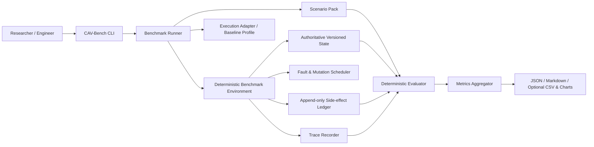
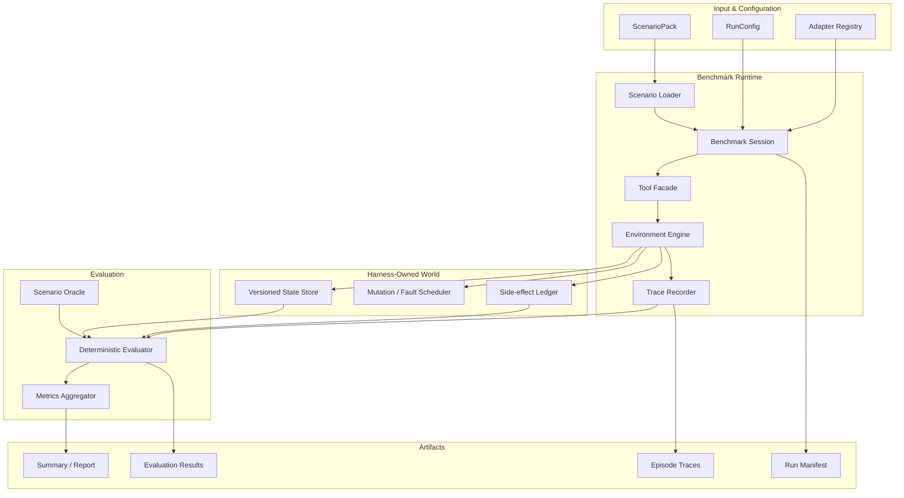
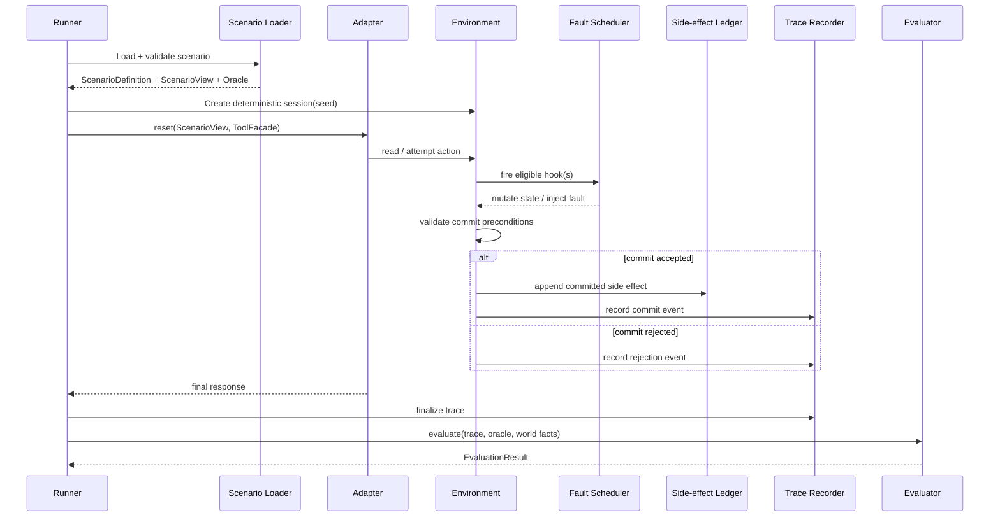

# CAV-Bench v1.0 Architecture

**Status:** Implementation-ready  
**Architecture style:** Local-first deterministic benchmark harness with pluggable execution adapters  
**Primary quality attributes:** Trust separation, determinism, reproducibility, extensibility, inspectability

---

## 1. Architectural objective

CAV-Bench must evaluate the validity of **actual consequential commits**, not the claims made by an agent or baseline profile about those commits.

The architecture therefore separates five responsibilities:

1. **Scenario definition** — what the world, rules, faults, and oracle are.
2. **Execution adapter** — what action strategy is being tested.
3. **Benchmark environment** — what authoritative state and side effects actually occur.
4. **Trace recorder** — what happened, in normalized chronological form.
5. **Evaluator** — what the trace and environment facts mean under the scenario oracle.

The evaluator is downstream of execution and must not trust validity labels generated by the adapter.

---

## 2. System context



---

## 3. Core trust model

### 3.1 Trusted benchmark-owned components

The following are trusted to compute benchmark truth:

- scenario loader and schema validator;
- private scenario oracle;
- authoritative state store;
- fault and mutation scheduler;
- side-effect ledger;
- trace recorder;
- evaluator;
- metrics aggregator.

### 3.2 Untrusted evaluation subject

The following must be treated as untrusted input:

- execution adapters;
- model outputs;
- tool-call arguments;
- agent final messages;
- adapter metadata;
- adapter-provided success claims.

### 3.3 Rule

**No adapter-controlled field may directly set or override OSR, PAOSR, CVSR, dimension status, invalid commit status, or failure codes.**

---

## 4. High-level component architecture



---

## 5. Data separation

### 5.1 Scenario definition

Each scenario should have two logical views.

#### Public/adapter-visible view

Contains only what the execution subject is allowed to know:

- user request;
- principal/tenant context exposed by the task;
- available tool schema;
- initial observations made through tools;
- ordinary runtime responses.

#### Benchmark-private oracle

Contains:

- goal predicates;
- authority and intent constraints;
- commit-time preconditions;
- scheduled mutations and faults;
- forbidden effects;
- required effects;
- recovery obligations;
- applicable dimensions.

The repository may publicly contain both because CAV-Bench v1.0 is an open methodology benchmark. However, the runtime API must still prevent an adapter from receiving the oracle object through normal execution interfaces.

---

## 6. Runtime sequence



---

## 7. Package architecture

Recommended repository structure:

```text
cav-bench/
├── README.md
├── LICENSE
├── CITATION.cff
├── CHANGELOG.md
├── CONTRIBUTING.md
├── CODE_OF_CONDUCT.md
├── SECURITY.md
├── pyproject.toml
├── src/
│   └── cavbench/
│       ├── __init__.py
│       ├── version.py
│       ├── cli.py
│       ├── config.py
│       ├── errors.py
│       │
│       ├── scenarios/
│       │   ├── loader.py
│       │   ├── models.py
│       │   ├── schemas/
│       │   │   ├── scenario-v1.schema.json
│       │   │   ├── trace-v1.schema.json
│       │   │   └── evaluation-v1.schema.json
│       │   └── packs/
│       │       └── core-v1/
│       │           ├── pack.json
│       │           └── scenarios/*.json
│       │
│       ├── runtime/
│       │   ├── session.py
│       │   ├── environment.py
│       │   ├── state.py
│       │   ├── faults.py
│       │   ├── ledger.py
│       │   ├── tools.py
│       │   └── trace.py
│       │
│       ├── adapters/
│       │   ├── protocol.py
│       │   └── baselines/
│       │       ├── direct.py
│       │       ├── policy_gated.py
│       │       ├── commit_guarded.py
│       │       ├── reconciled.py
│       │       └── full_lifecycle.py
│       │
│       ├── evaluation/
│       │   ├── evaluator.py
│       │   ├── predicates.py
│       │   ├── dimensions.py
│       │   ├── failure_codes.py
│       │   └── metrics.py
│       │
│       ├── reports/
│       │   ├── writer.py
│       │   ├── markdown.py
│       │   └── optional_charts.py
│       │
│       └── api.py
│
├── tests/
│   ├── unit/
│   ├── integration/
│   ├── contract/
│   ├── golden/
│   └── cli/
│
├── examples/
│   ├── custom_adapter.py
│   ├── custom_scenario_pack/
│   └── ci_threshold.sh
│
├── docs/
│   ├── methodology.md
│   ├── architecture.md
│   ├── scenario-authoring.md
│   ├── adapter-authoring.md
│   ├── reproducibility.md
│   └── release-process.md
│
└── scripts/
    ├── verify_release.py
    └── regenerate_baselines.py
```

---

## 8. Core domain model

### 8.1 ScenarioPack

Represents a versioned collection of scenarios.

Key fields:

- `pack_id`
- `pack_version`
- `schema_version`
- `description`
- `scenario_ids`
- `digest`

### 8.2 ScenarioDefinition

Internal benchmark representation containing:

- adapter-visible task view;
- initial state;
- tool configuration;
- deterministic injections;
- private oracle.

### 8.3 BenchmarkSession

Owns one scenario run:

- seed;
- environment;
- trace recorder;
- adapter;
- logical clock;
- run metadata.

### 8.4 TraceEvent

Canonical event type for all observable runtime events.

Every event has:

- sequence number;
- logical time;
- event type;
- actor/source;
- tool/action when applicable;
- resource references;
- state version information where applicable;
- operation/idempotency identity where applicable;
- response/result metadata.

### 8.5 SideEffect

Represents a committed external effect.

Required identity:

- effect ID;
- logical operation ID;
- effect type;
- resource reference;
- idempotency key if used;
- committed sequence;
- payload summary;
- compensation relationship if applicable.

### 8.6 EvaluationResult

Evaluator-owned result containing:

- OSR boolean;
- PAOSR boolean;
- CVSR boolean;
- dimension statuses;
- invalid commits;
- failure codes;
- diagnostics.

---

## 9. Commit path

The environment is the only component allowed to create a committed side-effect event.

Recommended flow:

```text
Adapter proposal
    ↓
ToolFacade validates call shape
    ↓
Environment applies scheduled pre-commit hooks
    ↓
Environment reads current authoritative state
    ↓
Environment evaluates atomic preconditions required by tool contract
    ↓
Rejected attempt OR committed mutation/effect
    ↓
Ledger append
    ↓
Trace event
```

The evaluator later decides whether the commit was valid under the scenario oracle.

The environment may enforce some safeguards for a profile, but it must not pre-label the resulting commit as valid or invalid for scoring.

---

## 10. State model

### Requirements

- resources are addressed by `namespace` + `resource_id`;
- each mutable resource has a monotonically increasing version;
- mutations support optional `expected_version`;
- stale expected versions produce a deterministic conflict;
- external mutations increment version exactly like adapter-driven writes;
- snapshots are immutable copies.

### Why this matters

Temporal state validity is evaluated at the observation-to-commit boundary. The state store must therefore make it possible to prove:

- what version was observed;
- what version existed at commit;
- whether the adapter attempted to use an atomic precondition;
- whether the environment accepted or rejected the commit.

---

## 11. Side-effect ledger model

The ledger is append-only for a run.

It must support:

- one logical operation producing zero or one effect under idempotent behavior;
- detection of duplicate logical effects;
- distinct operation IDs producing multiple effects even when final object state collapses them;
- compensation links;
- replay and inspection.

The ledger is benchmark truth for execution integrity.

---

## 12. Fault and mutation scheduler

The scheduler triggers deterministic injections at named hooks such as:

- before read;
- after read;
- before commit validation;
- after commit before response;
- before downstream step;
- after partial commit;
- during compensation.

Every injection must have:

- stable `fault_id`;
- trigger hook;
- deterministic order;
- one-shot or repeat behavior;
- mutation/fault payload.

The trace must record when an injection fires.

---

## 13. Adapter architecture

### Public protocol

Adapters must receive only:

- scenario view;
- benchmark tool facade;
- runtime context that does not expose the private oracle.

Adapters return:

- final message or structured completion;
- optional adapter metadata that is stored but never trusted for scoring.

### Baseline profiles

The five included deterministic architecture profiles implement the same public adapter protocol.

This is important because future adapters—LLM agents, MCP clients, agent frameworks—should plug into the same runner without evaluator changes.

---

## 14. Evaluator architecture

The evaluator consumes:

- scenario oracle;
- canonical episode trace;
- authoritative final state;
- side-effect ledger.

It computes:

1. goal predicate truth;
2. policy-aware outcome truth;
3. each applicable validity dimension;
4. invalid commit list;
5. recovery obligation status;
6. final CVSR;
7. diagnostic failure codes.

### Evaluator purity principle

Given the same validated scenario oracle and canonical trace/world facts, evaluation must be deterministic.

The evaluator must not:

- call a model;
- use wall-clock time;
- perform network requests;
- inspect adapter implementation details;
- trust adapter success flags.

---

## 15. Output architecture

Each run creates an immutable run directory:

```text
runs/<run-id>/
├── manifest.json
├── traces/
│   ├── <scenario-id>.json
│   └── ...
├── evaluations.jsonl
├── summary.json
├── summary.md
└── optional/
    ├── scenario_results.csv
    └── charts/*.png
```

The run manifest is the root reproducibility artifact.

---

## 16. Extensibility boundaries

### Stable extension point: ExecutionAdapter

Used for:

- deterministic baselines;
- real LLM agents;
- agent frameworks;
- future MCP adapter.

### Stable extension point: ScenarioPack

Used for:

- finance;
- healthcare;
- IT operations;
- customer service;
- other domains.

### Stable extension point: ReportExporter

Used for:

- Markdown;
- JSON;
- CSV;
- future dashboards.

The evaluator core should remain closed to casual extension in v1.0. New dimensions require a benchmark-version change and methodology review.

---

## 17. Security and privacy architecture

CAV-Bench v1.0 uses synthetic data only.

Requirements:

- no secrets in the repository;
- no real API credentials required;
- no network calls in core tests;
- no employer or production data;
- CI uses least privilege;
- optional adapters must isolate secrets from trace outputs.

The benchmark is not a sandbox against malicious adapter code. Document this explicitly.

---

## 18. Reproducibility architecture

Every result must be attributable to:

```text
CAV-Bench version
+ code commit
+ scenario-pack version and digest
+ adapter/profile name and version
+ seed
+ runtime environment
```

The report generator must surface these values near the top of every report.

---

## 19. Architecture acceptance tests

The implementation must demonstrate:

1. An adapter cannot set its own evaluation result.
2. A stale write can be detected from trace/state facts.
3. Duplicate side effects are visible even when final normalized state looks successful.
4. Recovery can be marked required and evaluated separately.
5. The same scenario/profile/seed reproduces the same metrics.
6. A custom adapter can be added without modifying the evaluator.
7. A custom scenario pack can be added without modifying the runner core.
